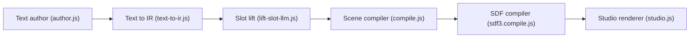

# shaun8149/sdf-js

> Bibliothèque JavaScript de fonctions de distance signées et plateforme Atlas qui génère des illustrations et scènes 3D par LLM.

## Le problème
La génération d'images par diffusion rate les structures exactes (horloges, diagrammes, icônes) et se modifie mal.

## Ce que ça fait vraiment
Un LLM (Anthropic Claude) écrit du code SDF à partir d'un texte ; sept moteurs de rendu (silhouette, stipple, lignes Pasma, Lambert, GPU) le dessinent, avec motifs de fond et export SVG. Atlas Present transforme un texte en deck de scènes assemblées en monde 3D. Beaucoup de feuille de route (M0–M7) : le simulateur de règles est un projet, non livré.

## Comment c'est branché


## Essayer
```bash
cd sdf-js
python3 dev-server.py 8001
open http://localhost:8001/examples/
```

## Coût et pièges
Les démos LLM demandent une clé d'API Anthropic ; le README annonce une galerie sans clé. Licence présente mais non identifiée. Le README, long, mêle argumentaire commercial et capacités réelles.

## Ce que ce n'est pas
Pas un simulateur de monde livré (M7 en feuille de route), ni un concurrent démontré de la diffusion : ce sont des affirmations de l'auteur.

## Alternatives
fogleman/sdf (Python, dont le projet est issu et qui n'est plus maintenu).

## Pour toi
À surveiller : l'idée « LLM écrit du code géométrique » est instructive, mais le projet est jeune, d'une personne, et sa licence est à clarifier.

