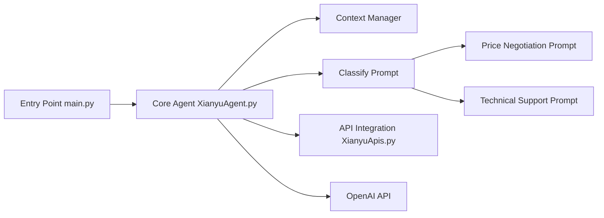

# shaxiu/XianyuAutoAgent

> Bot de service client LLM pour la plateforme chinoise de revente Xianyu, négociation incluse.

## Le problème
Un vendeur sur Xianyu doit répondre jour et nuit aux acheteurs, négocier les prix et renseigner sur les produits.

## Ce que ça fait vraiment
Script Python qui se connecte à Xianyu avec les cookies du navigateur, garde l'historique de conversation comme contexte, classe l'intention par prompt puis route vers un « expert » (prix avec baisse par paliers, technique avec recherche web, défaut). Les experts sont quatre fichiers de prompt modifiables. Un mot-clé bascule en reprise humaine. Qwen par défaut, tout modèle compatible OpenAI sinon.

## Comment c'est branché


## Essayer
```bash
git clone https://github.com/shaxiu/XianyuAutoAgent.git
cd XianyuAutoAgent
pip install -r requirements.txt
python main.py
```

## Coût et pièges
Clé de modèle à ta charge et cookies de session Xianyu extraits à la main. L'auteur prévient qu'il peut arrêter ou supprimer le projet à tout moment.

## Ce que ce n'est pas
Pas une intégration officielle : repose sur des API Xianyu rétro-ingéniérées (XianYuApis), usage « pour l'apprentissage ». Pas de RAG ni d'interface web (annoncés).

## Alternatives
Aucune alternative nommée ; le projet s'appuie sur cv-cat/XianYuApis.

## Pour toi
À ignorer : cas d'usage lié à une plateforme chinoise, API non officielles et avenir incertain ; seul le routage d'intentions par prompts peut servir d'exemple simple.
