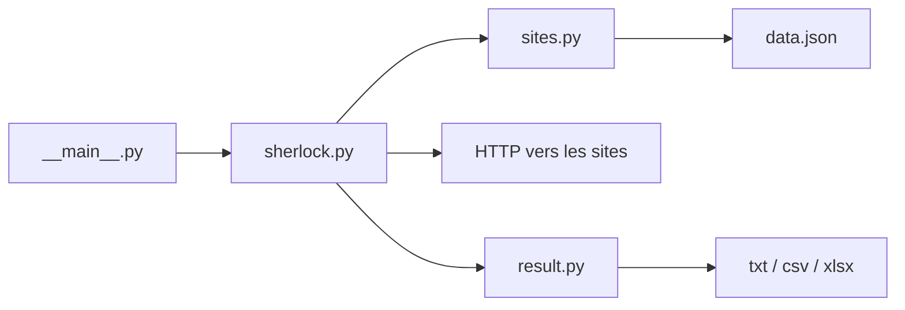

# sherlock-project/sherlock

> Outil en ligne de commande qui cherche un nom d'utilisateur sur plus de 400 réseaux sociaux.

## Le problème
Savoir sur quels sites un même pseudonyme existe demande de tester chaque site à la main. Sherlock automatise ce recensement.

## Ce que ça fait vraiment
- Prend un ou plusieurs pseudonymes en argument.
- Parcourt un catalogue de sites (`data.json`), construit l'URL de profil de chacun et classe la réponse : trouvé, non trouvé, ambigu.
- Exporte en fichier texte, CSV ou XLSX ; options de proxy, de délai et de filtre par site.
- Le catalogue de sites est séparé du moteur et maintenu par des workflows de validation.

## Comment c'est branché


## Essayer
```bash
pipx install sherlock-project
sherlock user123
sherlock user1 user2 user3
docker run -it --rm sherlock/sherlock
```

## Coût et pièges
Gratuit, sans clé d'API. Faux positifs possibles quand un site change son comportement ; certains paquets tiers (ParrotOS, Ubuntu 24.04) sont signalés cassés, préférer pipx, pip, uv ou Docker.

## Ce que ce n'est pas
Ce n'est pas une source d'identité fiable : un pseudonyme trouvé ne prouve pas que le compte appartient à la personne visée. Il concerne des données personnelles : l'usage sur autrui relève du RGPD et du droit local, il faut une base légale (recherche sur soi-même, audit autorisé, enquête encadrée).

## Alternatives
Aucune alternative nommée dans le README.

## Pour toi
À surveiller : utile pour un audit de son exposition en ligne ou du renseignement en sources ouvertes encadré, mais sans lien direct avec un travail data / IA / MLOps.

