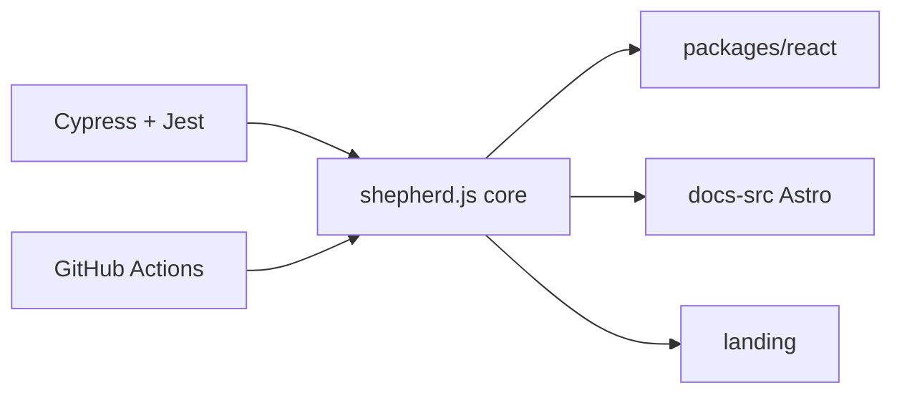

# shipshapecode/shepherd

> Bibliothèque JavaScript de visites guidées pour intégrer de nouveaux utilisateurs dans une application web.

## Le problème
Les nouveaux utilisateurs se perdent dans une interface sans parcours d'accueil.

## Ce que ça fait vraiment
Bibliothèque cœur indépendante des frameworks (Rollup, Babel) et enveloppes React, Angular, Vue, Ember. Monorepo pnpm avec site de docs et landing page Astro, tests Cypress et Jest. Le README mentionne aussi des services sur mesure (« White Glove Services ») et une licence commerciale, d'après l'architecture décrite.

## Comment c'est branché

## Essayer
Aucune commande dans le README : il renvoie à la documentation et aux tutoriels des enveloppes.

## Coût et pièges
Gratuit pour l'édition open source ; licence non identifiée par GitHub, à lire. Angular, Vue et Ember : wrappers hors de ce dépôt.

## Ce que ce n'est pas
Pas un outil d'analytique produit : uniquement des tours et annonces.

## Alternatives
Aucune alternative citée dans le README.

## Pour toi
À ignorer : outil d'UX front-end ; utile seulement si tu livres une application web à des utilisateurs à guider.

