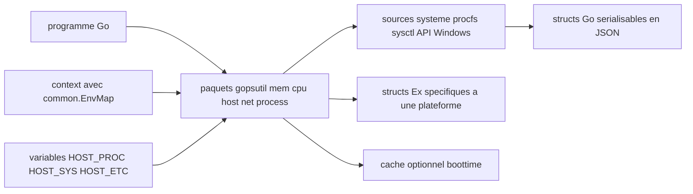

# shirou/gopsutil

> **Read CPU, memory, disk, network and process data from Go, across several operating systems.**

## The problem

Without this library, a metrics agent written in Go has to read `/proc` itself on Linux, call
Win32 APIs on Windows and sysctl on BSD, with different code per system and per architecture.
The README presents the project as a port of psutil, whose stated challenge is exactly to
cover every function on every architecture.

## What it actually does

Provides Go packages (`mem`, `cpu`, `host`, `load`, `disk`, `net`, `process`, `docker`,
`sensors`) whose functions return structs that serialize to JSON and implement `String()`.
The README uses `mem.VirtualMemory()` as its worked example. Everything is implemented
without cgo, by porting C structs to Go structs. "Current Status" tables state, function by
function and system by system, what works, what is partially broken and what is missing —
that is the real coverage documentation. A few metrics are not in psutil at all: `HostInfo()`
with virtualization detection, detailed `CPUInfo()`, `net_protocols`, `netfilter_conntrack`
and the Docker cgroup helpers (Linux only).

## How it is wired



The README describes three configuration inputs with an explicit priority order: the value
set in the `context` (via `common.EnvKey` / `common.EnvMap`, since v3.23.6), then the
environment variable (`HOST_PROC`, `HOST_SYS`, `HOST_ETC`, `HOST_VAR`, `HOST_RUN`,
`HOST_DEV`, `HOST_ROOT`, `HOST_PROC_MOUNTINFO`), then the default location. Functions then
read the system source and return structs. Since v4.24.5, `Ex` structs (`mem.NewExLinux()`,
`mem.ExWindows()`) expose information that exists only on one platform. An optional boottime
cache exists in `host` and `process`, disabled by default.

## Trying it

The README gives no shell installation command; it gives a full program:

```go
package main

import (
    "fmt"

    "github.com/shirou/gopsutil/v4/mem"
)

func main() {
    v, _ := mem.VirtualMemory()

    // almost every return value is a struct
    fmt.Printf("Total: %v, Free:%v, UsedPercent:%f%%\n", v.Total, v.Free, v.UsedPercent)

    // convert to JSON. String() is also implemented
    fmt.Println(v)
}
```

Reference documentation: https://pkg.go.dev/github.com/shirou/gopsutil/v4

## Cost and traps

Free, no API key, no third-party service; the only stated requirement is go1.18 or above.
The traps are elsewhere. Coverage is uneven: the tables show blanks or `b` ("almost works,
but something is broken") depending on the system — `swap_memory` missing on Windows,
`cpu_times` broken on Plan 9. Versioning is calver (`v4.24.04` = major 4, year 2024, month
04), so a rising number says nothing about the size of the change. The move to v4 has
breaking changes, deferred to a release note. The README itself warns that enabling the cache
"may cause inconsistencies", with the NTP-changed boottime as example. GitHub reports the
license as NOASSERTION while the README states "New BSD License": worth checking before any
constrained use.

## What it is not

Not a monitoring agent and not a metrics exporter: nothing is collected, stored or exposed —
it is a library you call from your own code. Not a complete psutil equivalent either: the
README explicitly lists future work (`process_iter`, `wait_procs`, `as_dict`, `wait`, AIX
processes). And not a uniform abstraction: the `Ex` structs exist precisely because platforms
do not expose the same information, and several Docker and network features are marked Linux
only.

## Alternatives

- `giampaolo/psutil`: the Python original, preferable when the calling code is Python.
- `cloudfoundry/gosigar` and `mitchellh/go-ps`, both named in the README: narrower scope
  (go-ps only lists processes) when you do not need the full surface.
- Among the catalogue neighbours, `avelino/awesome-go`, `samber/lo`, `google/wire` and
  `google/go-github` have nothing to do with system metrics: no comparable alternative there.

## For you

Useful as soon as you instrument a Go piece of MLOps infrastructure — a training worker, an
inference server, a runner — and want memory, CPU and process state without writing a `/proc`
reader per system. Read the coverage table for your target platform first: it decides whether
the metric you want exists at all.
