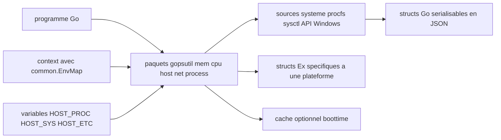

# shirou/gopsutil

> **Lire CPU, mémoire, disque, réseau et processus depuis un programme Go, sur plusieurs systèmes.**

## Le problème

Sans cette bibliothèque, un agent de métrologie écrit en Go doit lire lui-même `/proc` sur
Linux, appeler des API Win32 sur Windows et des sysctl sur BSD, avec un code différent par
système et par architecture. Le README présente le projet comme un portage de psutil, dont
l'enjeu annoncé est justement de couvrir toutes les fonctions sur toutes les architectures.

## Ce que ça fait vraiment

Expose des paquets Go (`mem`, `cpu`, `host`, `load`, `disk`, `net`, `process`, `docker`,
`sensors`) dont les fonctions renvoient des structs, sérialisables en JSON et dotées d'un
`String()`. Le README documente `mem.VirtualMemory()` comme exemple type. Tout est implémenté
sans cgo, par transcription des structs C en structs Go. Des tableaux « Current Status »
disent, fonction par fonction et système par système, ce qui marche, ce qui est cassé et ce
qui manque — c'est la vraie documentation de couverture. Quelques métriques n'existent pas
dans psutil : `HostInfo()` avec virtualisation, `CPUInfo()` détaillé, `net_protocols`,
`netfilter_conntrack`, les cgroups Docker (Linux uniquement).

## Comment c'est branché



Le README décrit trois chemins d'entrée pour la configuration, dans un ordre de priorité
explicite : la valeur posée dans le `context` (via `common.EnvKey` / `common.EnvMap`, depuis
v3.23.6), puis la variable d'environnement (`HOST_PROC`, `HOST_SYS`, `HOST_ETC`, `HOST_VAR`,
`HOST_RUN`, `HOST_DEV`, `HOST_ROOT`, `HOST_PROC_MOUNTINFO`), puis l'emplacement par défaut.
Les fonctions lisent ensuite la source système et rendent des structs. Depuis v4.24.5, les
structs `Ex` (`mem.NewExLinux()`, `mem.ExWindows()`) donnent accès à l'information qui
n'existe que sur une plateforme. Un cache optionnel de boottime existe côté `host` et
`process`, désactivé par défaut.

## Essayer

Le README ne donne pas de commande shell d'installation ; il donne un programme complet :

```go
package main

import (
    "fmt"

    "github.com/shirou/gopsutil/v4/mem"
)

func main() {
    v, _ := mem.VirtualMemory()

    // almost every return value is a struct
    fmt.Printf("Total: %v, Free:%v, UsedPercent:%f%%\n", v.Total, v.Free, v.UsedPercent)

    // convert to JSON. String() is also implemented
    fmt.Println(v)
}
```

Documentation de référence : https://pkg.go.dev/github.com/shirou/gopsutil/v4

## Coût et pièges

Gratuit, aucune clé d'API, aucun service tiers : seule contrainte annoncée, go1.18 ou plus.
Les pièges sont ailleurs. La couverture est inégale : les tableaux marquent des cases vides
ou `b` (« almost works, but something is broken ») selon le système — par exemple
`swap_memory` absent sur Windows, `cpu_times` cassé sur Plan 9. Le versionnage est du calver
(`v4.24.04` = majeure 4, année 2024, mois 04), donc un numéro qui monte ne dit rien de
l'ampleur du changement. Le passage en v4 comporte des ruptures renvoyées à une note de
version. Le README avertit lui-même que l'activation du cache « may cause inconsistencies »,
avec l'exemple du boottime modifié par NTP. La licence déclarée par GitHub est NOASSERTION
alors que le README annonce « New BSD License » : à vérifier avant un usage contraint.

## Ce que ce n'est pas

Ce n'est pas un agent de supervision ni un exportateur de métriques : rien n'est collecté,
stocké ni exposé, c'est une bibliothèque qu'on appelle depuis son propre code. Ce n'est pas
un équivalent complet de psutil : le README liste explicitement ce qui reste à faire
(`process_iter`, `wait_procs`, `as_dict`, `wait`, processus AIX). Ce n'est pas non plus une
abstraction uniforme : les structs `Ex` existent précisément parce que les plateformes ne
donnent pas la même information, et une partie des fonctions Docker et réseau est marquée
Linux only.

## Alternatives

- `giampaolo/psutil` : l'original en Python, à préférer si le code appelant est en Python.
- `cloudfoundry/gosigar` et `mitchellh/go-ps`, cités par le README : périmètre plus étroit
  (go-ps ne couvre que la liste des processus) si l'on n'a pas besoin de tout le spectre.
- Parmi les voisins du catalogue, `avelino/awesome-go`, `samber/lo`, `google/wire` et
  `google/go-github` ne traitent pas de métriques système : aucune alternative comparable de
  ce côté.

## Pour toi

Utile dès qu'on instrumente en Go une brique d'infra MLOps — worker d'entraînement, serveur
d'inférence, runner — et qu'on veut remonter mémoire, CPU et état des processus sans écrire
un lecteur `/proc` par système. À lire d'abord : le tableau de couverture de la plateforme
cible, car c'est lui qui décide si la métrique voulue existe.
