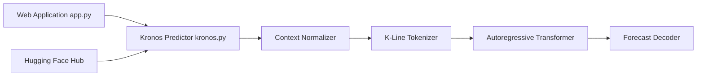

# shiyu-coder/Kronos

> Modèle de fondation pour chandeliers financiers (K-lines), pour quants et chercheurs en prévision de séries.

## Le problème
Les modèles de séries temporelles généralistes gèrent mal les données financières, très bruitées.

## Ce que ça fait vraiment
Kronos traite les chandeliers OHLCV en deux étapes : un tokenizer les quantifie en jetons discrets hiérarchiques, puis un Transformer autoregressif prédit les jetons futurs, décodés en bougies. Modèles sur Hugging Face : Kronos-mini (4,1 M paramètres), small (24,7 M), base (102,3 M) ; Kronos-large (499,2 M) n'est pas publié. `KronosPredictor` normalise, prédit en un ou plusieurs chemins et dénormalise. Un pipeline de finetuning existe avec Qlib (actions A-share).

## Comment c'est branché


## Essayer
```bash
pip install -r requirements.txt
pip install pyqlib
python finetune/qlib_data_preprocess.py
torchrun --standalone --nproc_per_node=NUM_GPUS finetune/train_tokenizer.py
torchrun --standalone --nproc_per_node=NUM_GPUS finetune/train_predictor.py
python finetune/qlib_test.py --device cuda:0
```

## Coût et pièges
Gratuit (MIT) ; Python 3.10+, GPU conseillé et entraînement multi-GPU avec `torchrun`. Contexte maximal de 512 pour small et base. Les commentaires du dossier `finetune/` ont été générés par une IA et peuvent contenir des erreurs.

## Ce que ce n'est pas
Pas un système de trading : le README parle d'une démonstration, non d'une stratégie prête pour le réel. Aucun résultat chiffré n'y figure. Pas d'alpha pur sans neutralisation des facteurs de risque.

## Alternatives
- Aucune alternative nommée dans le README.

## Pour toi
Surveiller : un modèle de fondation pour chandeliers est un bon terrain d'essai pour ta prévision de séries financières, mais un projet jeune (créé en juillet 2025) dont le README ne chiffre aucun résultat.

