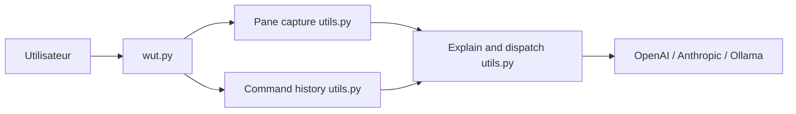

# shobrook/wut

> CLI qui demande à un LLM d'expliquer la sortie de ta dernière commande dans tmux ou screen.

## Le problème
Un message d'erreur ou une trace de pile obscure oblige à copier-coller dans un chat pour comprendre.

## Ce que ça fait vraiment
Tu tapes `wut` après une commande. L'outil détecte le shell, capture le contenu du panneau tmux/screen, récupère l'historique, construit un prompt et interroge OpenAI, Anthropic ou un modèle Ollama local, puis affiche la réponse en Markdown. Une question libre peut être ajoutée.

## Comment c'est branché


## Essayer
```bash
pipx install wut-cli
export OPENAI_API_KEY="..."
export OLLAMA_MODEL="..."
wut
wut "how do i add this to my PATH variable?"
```

## Coût et pièges
Clé d'API OpenAI ou Anthropic à ta charge, ou Ollama local. Fonctionne seulement dans une session tmux ou screen.

## Ce que ce n'est pas
Pas un agent qui corrige : il explique. Sans tmux/screen, il ne voit rien. Dernier push fin 2024.

## Alternatives
Aucune alternative citée dans le README.

## Pour toi
À surveiller : pratique et trivial à installer pour le quotidien en terminal, mais peu actif depuis fin 2024 et sans enjeu stratégique.

