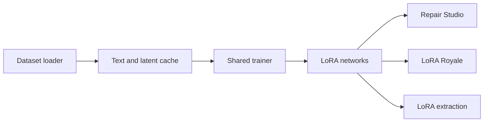

# shootthesound/Fizgig

> Atelier d'entraînement et de réparation de LoRA pour Flux 2 Klein, Krea 2 et MiniMax H3, sur GPU grand public.

## Le problème
Entraîner un LoRA sur 16 Go de VRAM est délicat, et un LoRA surappris ne se corrige pas sans tout relancer.

## Ce que ça fait vraiment
Une application de bureau prépare le jeu de données, écrit des légendes, entraîne des LoRA (ou affine le modèle complet, en expérimental) avec planification automatique de VRAM. Après entraînement : Repair Studio règle chaque bloc, Explorer fait évoluer un LoRA, Royale compare chaque époque, Profiler et Extract analysent et réduisent le rang. Gère photos, clips vidéo et voix ; sortie safetensors pour ComfyUI. Option RunPod.

## Comment c'est branché


## Essayer
```bash
git clone https://github.com/shootthesound/Fizgig.git
cd Fizgig
python install_fizgig.py
./run_fizgig.sh
python -m fizgig.scripts.fetch_models --family krea2
```

## Coût et pièges
Gratuit, mais GPU NVIDIA 30/40/50 ou AMD ROCm, 32 Go de RAM conseillés (48 Go avec aperçus), 40 Go de modèles. Fine-tuning complet : checkpoints de 21 à 26 Go. Linux ROCm très expérimental.

## Ce que ce n'est pas
Pas un service en ligne : tout tourne sur ta machine ou un pod loué. Le fine-tuning complet est marqué expérimental, NVIDIA seulement.

## Alternatives
Le README cite ComfyUI comme cible de déploiement, et mentionne kohya, OneTrainer, AI-Toolkit et LyCORIS dont il charge les LoRA.

## Pour toi
Surveiller : très riche pour l'IA générative d'images/vidéo, mais orienté création et demande un GPU costaud ; peu de rapport avec la data d'entreprise.
