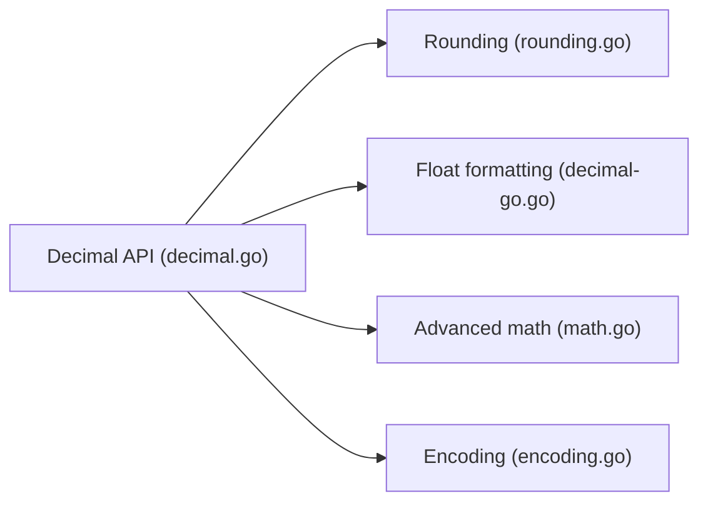

# shopspring/decimal

> Nombres décimaux à virgule fixe de précision arbitraire en Go, pour montants et calculs exacts.

## Le problème
`float64` ne représente pas exactement 0,1 ; les erreurs s'accumulent, notamment sur de l'argent.

## Ce que ça fait vraiment
Type `Decimal` immuable, valeur zéro utilisable, addition, soustraction, multiplication exactes, division à précision choisie, arrondis, sérialisation `database/sql`, JSON et XML, mathématiques avancées. Au plus 2^31 chiffres après la virgule.

## Comment c'est branché


## Essayer
```bash
go get github.com/shopspring/decimal
```
```go
price, _ := decimal.NewFromString("136.02")
subtotal := price.Mul(decimal.NewFromInt(3))
```

## Coût et pièges
Gratuit. Plus lent et plus gourmand en allocations que `big.Int` (assumé par l'auteur). Licence non identifiée par GitHub.

## Ce que ce n'est pas
Pas un type haute performance ; il faut répartir soi-même les restes (diviser par 3).

## Alternatives
- cockroachdb/apd : plus rapide, API mutable proche de `big.Int`.
- alpacahq/alpacadecimal : rapide, précision limitée à 12 chiffres.
- govalues/decimal : rapide, sans allocation, 19 chiffres.

## Pour toi
À surveiller : utile pour des calculs monétaires exacts en Go ; vérifier la licence avant intégration.

