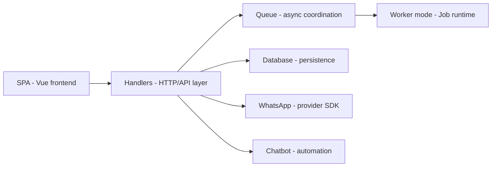

# shridarpatil/whatomate

> Plateforme WhatsApp Business auto-hébergée, en binaire unique, pour équipes de support et campagnes.

## Le problème
Gérer conversations, modèles, campagnes et agents sur l'API WhatsApp Business demande plusieurs outils.

## Ce que ça fait vraiment
Un binaire Go embarquant un front Vue 3, avec PostgreSQL et Redis. Multi-organisations, rôles fins, chat temps réel par WebSocket, modèles Meta, campagnes avec reprise, chatbot (mots-clés, flux, réponses IA via OpenAI, Anthropic ou Google), appels vocaux et IVR. Modes `server` et `worker` pour séparer l'API du traitement asynchrone.

## Comment c'est branché


## Essayer
```bash
curl -LO https://raw.githubusercontent.com/shridarpatil/whatomate/main/docker/docker-compose.yml
cp config.example.toml config.toml
docker compose up -d
./whatomate server -migrate
```
Connexion par défaut `admin@admin.com` / `admin` : à changer.

## Coût et pièges
Compte Meta Business et API WhatsApp Cloud (messages facturés par Meta) ; clés des fournisseurs d'IA si le chatbot IA est activé. AGPL-3.0.

## Ce que ce n'est pas
Pas une alternative sans Meta : tout passe par l'API officielle. Mot de passe admin par défaut à corriger.

## Alternatives
Aucune alternative nommée dans le README.

## Pour toi
À ignorer : outil de relation client, hors périmètre data/IA/MLOps, et copyleft réseau fort.

