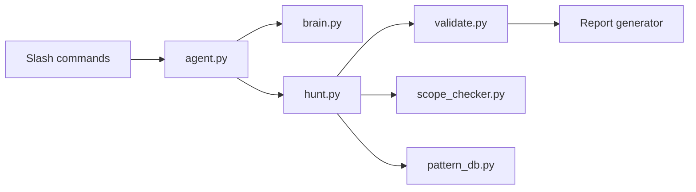

# shuvonsec/claude-bug-bounty

> Boîte à outils CLI et plugin Claude Code qui assiste le chasseur de bugs dans un programme de bug bounty.

## Le problème
Un chasseur de bugs répète les mêmes étapes (reconnaissance, tests, tri, rédaction du rapport) et perd du temps sur des constats trop faibles pour être acceptés.

## Ce que ça fait vraiment
- Enchaîne reconnaissance, tests, validation et rapport, via des commandes slash (Claude Code) ou la commande autonome `bughunter`.
- Une « porte » de 7 questions écarte les constats faibles avant rédaction ; les rapports ciblent HackerOne, Bugcrowd, Intigriti et Immunefi.
- Un vérificateur de périmètre (`scope_checker.py`) s'exécute avant les tests, avec journal d'audit, limitation de débit et disjoncteur ; une mémoire garde les résultats d'une session à l'autre.
- Neuf agents spécialisés, un serveur MCP, des intégrations Burp et HackerOne. À n'utiliser que dans le périmètre autorisé par le programme.

## Comment c'est branché


## Essayer
```bash
git clone https://github.com/Awarexone/Agentic-Bug-Hunter.git
cd Agentic-Bug-Hunter
./install.sh --agent standalone
bughunter setup
bughunter recon target.com
bughunter validate "finding"
bughunter report
```

## Coût et pièges
Gratuit avec Ollama en local (modèle d'environ 9 Go) ; sinon clé d'API à ta charge (Groq, DeepSeek, Claude, OpenAI…). Les scanners externes (subfinder, nuclei, etc.) s'installent à part avec `install_tools.sh`.

## Ce que ce n'est pas
Ce n'est pas une garantie de primes : les fourchettes de gains du README sont indicatives. Le nom du dépôt (shuvonsec/claude-bug-bounty) diffère de celui des URL du README (Awarexone/Agentic-Bug-Hunter), et la licence n'est pas déclarée. Toute activité hors périmètre d'un programme est illégale.

## Alternatives
Aucune alternative n'est nommée dans le README.

## Pour toi
À surveiller : intéressant surtout pour ses patterns d'agents (garde-fous de périmètre, mémoire, disjoncteur) ; peu utile à un profil data/MLOps hors chasse aux bugs, et la licence est à clarifier.
