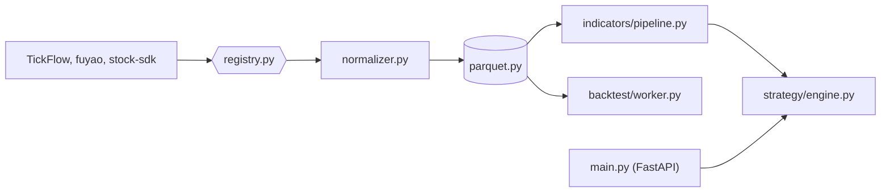

# shy3130/tick-stock-panel

> Poste de travail quant auto-hébergé pour actions A chinoises : sélection, surveillance, backtest.

## Le problème
Faire du quant avec des scripts épars : source de données figée dans le code, sélection, backtest et surveillance dans des outils aux conventions différentes, marché surveillé à l'œil.

## Ce que ça fait vraiment
Un registre route chacune des 6 familles de données vers une source qui la supporte (TickFlow, fuyao, stock-sdk, YAML) ; changer de source ne change pas les indicateurs.
Données normalisées en Parquet (DuckDB pour les requêtes) ; pipeline Polars qui dérive 68 colonnes d'indicateurs et signaux de 15 colonnes de base.
25 stratégies intégrées, backtests (T+1, frais, glissement) en sous-processus isolé, facteurs en DSL, minage hors échantillon.
Alertes (pop-up, voix, Feishu), assistant IA à 18 outils en lecture seule. FastAPI + React, un seul conteneur.

## Comment c'est branché


## Essayer
```bash
docker run -d --name tsp -p 3018:3018 -v ${PWD}/data:/app/data ghcr.io/shy3130/tick-stock-panel:latest
cp .env.example .env
docker compose up --build
./dev.sh
```

## Coût et pièges
Sans clé TickFlow, mode « None » : historique journalier gratuit seulement ; les paliers Free à Expert débloquent le reste. IA optionnelle via une clé OpenAI-compatible. Le mode Codex CLI monte tes identifiants Codex dans le conteneur.

## Ce que ce n'est pas
Pas un logiciel d'investissement ni un terminal de cotation : le README l'exclut, sans recommandation ni prédiction.
Limité au marché A chinois ; interface et doc en chinois.
L'auteur dit répondre en priorité aux sponsors.

## Alternatives
Aucune alternative nommée (同花顺 et 通达信 sont cités comme non-cibles, pas comme dépôts).

## Pour toi
Hors périmètre sauf actions A ; l'architecture Polars + Parquet + routage de sources mérite une lecture.
