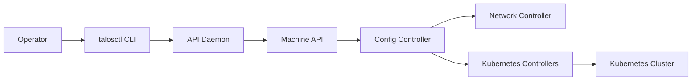

# siderolabs/talos

> Système d'exploitation Linux minimal et immuable dédié à Kubernetes, administré uniquement par API.

## Le problème
Les nœuds Kubernetes sur Linux généraliste dérivent en configuration et exposent une large surface d'attaque (SSH, shell).

## Ce que ça fait vraiment
OS sans shell ni console interactive : toute la gestion passe par une API sécurisée en mTLS.
L'opérateur utilise `talosctl` pour provisionner et gérer les nœuds ; le démon API transmet à `machined`.
Des contrôleurs réconcilient configuration, stockage, réseau, conteneurs et état Kubernetes.
Mises à jour atomiques, infrastructure immuable, versions stables de Kubernetes et Linux.

## Comment c'est branché

## Essayer
Aucune commande dans le README : il renvoie à la documentation.

## Coût et pièges
Gratuit, MPL-2.0 ; support commercial par Sidero Labs. Absence de shell : le débogage passe par l'API.

## Ce que ce n'est pas
Pas une distribution Linux polyvalente : impossible d'y installer des paquets à la main.
Pas un gestionnaire de cluster multi-cloud en soi.

## Alternatives
Aucune alternative nommée dans le README.

## Pour toi
À surveiller si tu opères toi-même des clusters Kubernetes pour du training ou du serving : réduit la dérive des nœuds, hors sujet si tu restes sur du managé.
