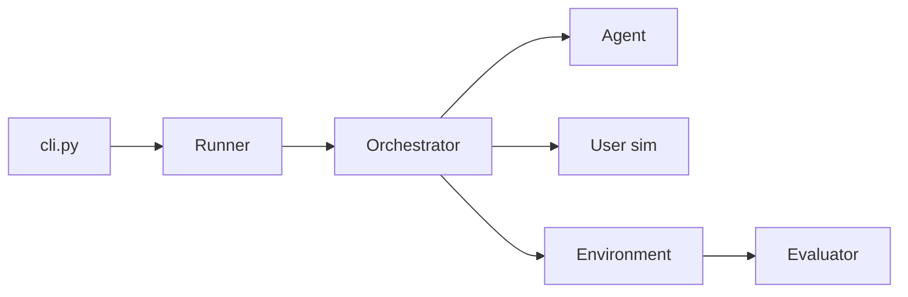

# sierra-research/tau2-bench

> Banc d'essai simulant un utilisateur et des outils pour évaluer des agents de service client.

## Le problème
Évaluer un agent d'outils suppose des scénarios réalistes, une politique à respecter et un utilisateur simulé, difficiles à reproduire.

## Ce que ça fait vraiment
Chaque domaine (airline, retail, telecom, banking_knowledge, mock) fournit une politique, des outils et des tâches. Un orchestrateur fait dialoguer l'agent, l'environnement et le simulateur d'utilisateur ; un évaluateur note les actions et les communications, puis des métriques agrègent les résultats. Le domaine banking_knowledge ajoute un pipeline RAG ; le mode vocal full-duplex passe par des API temps réel (OpenAI, Gemini, xAI). Un classement est publié sur taubench.com.

## Comment c'est branché


## Essayer
```bash
git clone https://github.com/sierra-research/tau2-bench
cd tau2-bench
uv sync
cp .env.example .env
tau2 run --domain airline --agent-llm gpt-4.1 --user-llm gpt-4.1 \
  --num-trials 1 --num-tasks 5
```

## Coût et pièges
Clés d'API à ta charge pour l'agent et l'utilisateur simulé : le coût croît avec tâches et essais. Installation via `uv`, Python 3.12+. La version 1.0.1 a modifié des scores sur banking_knowledge.

## Ce que ce n'est pas
Pas un cadre d'entraînement (une interface gym existe en option). Ne mesure que le service client dans les domaines fournis.

## Alternatives
- Aucune alternative nommée dans le README.

## Pour toi
Adopter si tu évalues des agents à outils : cadre reproductible, mais mesure d'abord le coût sur un petit essai.
