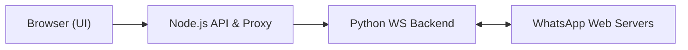

# sigalor/whatsapp-web-reveng

> Documentation de rétro-ingénierie du protocole WhatsApp Web (ancien) et implémentation de référence en Python/Node.

## Le problème
Le protocole WebSocket de WhatsApp Web n'est pas documenté publiquement.

## Ce que ça fait vraiment
Décrit la connexion, la génération du QR code, l'échange de clés (Curve25519, HKDF, AES-CBC, HMAC), le format binaire des messages, les médias chiffrés. Le code combine un client navigateur, un proxy Node (ports 2018/2020) et un backend Python 2.7 (port 2019) qui parle aux serveurs WhatsApp. Le README dresse aussi la liste de réimplémentations dans d'autres langages.

## Comment c'est branché


## Essayer
```bash
npm install -f
pip install -r requirements.txt
npm start
docker build . -t whatsapp-web-reveng
```

## Coût et pièges
Gratuit, mais Python 2.7 (fin de vie) et Node 8+ ; le README dit la version Docker non stable. Le protocole décrit est ancien ; risque de blocage de compte, projet non affilié à WhatsApp.

## Ce que ce n'est pas
Pas un client fonctionnel actuel : envoi de messages et reprise de session non implémentés. Le dernier push date d'avril 2024.

## Alternatives
- Baileys (adiwajshing), whatsapp-web.js non cité ; README nomme aussi go-whatsapp, kyros, whatsappweb-rs.

## Pour toi
À ignorer : protocole obsolète, stack Python 2 ; utile seulement comme lecture historique.

