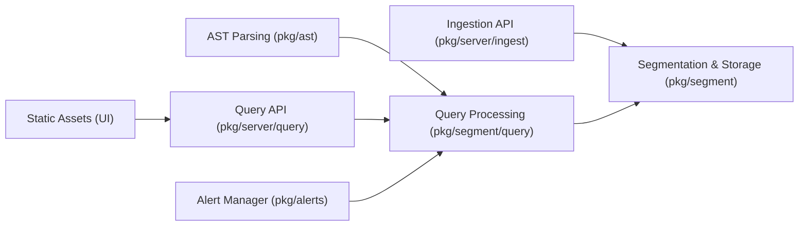

# siglens/siglens

> Base d'observabilité en un binaire Go pour logs, métriques et traces, désormais archivée.

## Le problème
Les outils d'observabilité sont chers (Splunk, Datadog) ou lourds à opérer (Elasticsearch), et les données sont dispersées entre logs, métriques et traces.

## Ce que ça fait vraiment
Un binaire unique ingère OpenTelemetry, Elastic, Splunk HEC et Loki, stocke en segments et répond en SPL Splunk ou SQL. Alertes, dashboards, tracing et live tail. Les chiffres de vitesse et de débit (8 To/jour, 1025 x Elasticsearch) viennent de billets du projet, non vérifiés ici.

## Comment c'est branché

## Essayer
Le README ne contient aucune commande : les liens d'installation (Git, Docker, Helm) ont été retirés du texte fourni. Aucune commande documentée.

## Coût et pièges
Gratuit ; licence Apache-2.0 après le changement annoncé. Dépôt en lecture seule depuis le 2026-03, 104 issues ouvertes sans suite.

## Ce que ce n'est pas
Pas un projet vivant : l'équipe « se concentre sur autre chose ». Les comparatifs de performance sont des arguments marketing.

## Alternatives
- Splunk, Datadog, NewRelic : cités comme chers.
- Elasticsearch, Grafana Loki, ClickHouse : comparés par le projet.

## Pour toi
À ignorer : archivé, donc sans correctifs de sécurité ; à utiliser au mieux comme référence de code ou fork.
