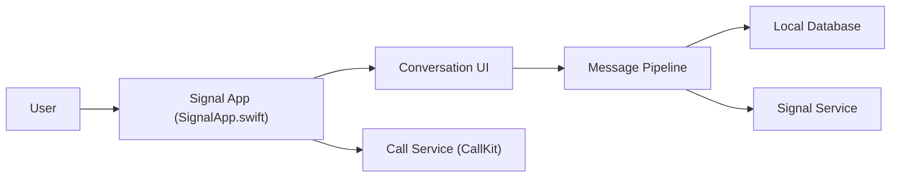

# signalapp/Signal-iOS

> Code source de l'application de messagerie chiffrée Signal pour iPhone.

## Le problème
Échanger des messages privés sans confier son contenu à un service qui le lit.

## Ce que ça fait vraiment
Le README est très court : messagerie libre pour communiquer en privé, version iOS. D'après l'architecture décrite du code : cycle de vie de l'app, inscription, base locale, pipeline de messages, appels (CallKit), partage de médias, sauvegardes, transfert d'appareil, notifications. Plusieurs modules centraux n'ont pas été échantillonnés.

## Comment c'est branché

## Essayer
Aucune commande documentée dans le README.

## Coût et pièges
Gratuit ; repose sur le service Signal. Compilation iOS non documentée ici. Le README contient un avertissement sur l'export de logiciels de chiffrement.

## Ce que ce n'est pas
Pas une bibliothèque réutilisable, et pas un client pour un serveur tiers. Licence AGPL-3.0.

## Alternatives
Aucune alternative nommée dans le README.

## Pour toi
Ignorer côté veille data/IA : c'est une application de messagerie, et l'AGPL-3.0 interdit de la réutiliser dans du code propriétaire.

