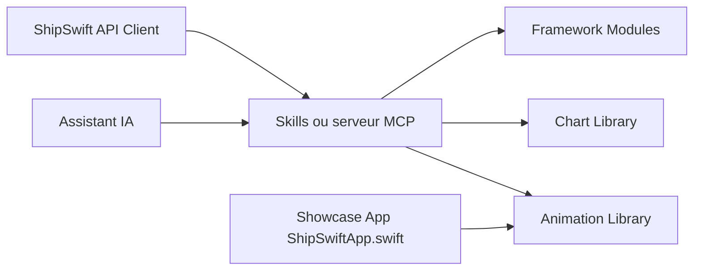

# signerlabs/ShipSwift

> Bibliothèque de composants SwiftUI et recettes que des assistants IA récupèrent pour construire des applis iOS.

## Le problème
Un assistant de code produit du SwiftUI générique ou obsolète et réinvente animations, graphiques et modules d'authentification.

## Ce que ça fait vraiment
Fournit des composants SwiftUI (animations Metal, graphiques, UI, modules Auth, Camera, Paywall StoreKit 2, Chat, etc.) et des « recettes ». Un serveur MCP (`listRecipes`, `getRecipe`, `searchRecipes`) ou des skills locaux les exposent à Claude Code ou Gemini CLI. Des recettes Pro (backend, conformité, pièges) sont payantes. Application vitrine incluse.

## Comment c'est branché


## Essayer
```bash
npx skills add signerlabs/shipswift-skills
claude mcp add --transport http shipswift https://api.shipswift.app/mcp
npx skills add signerlabs/ShipSwift
```

## Coût et pièges
Le code client iOS est MIT ; les recettes Pro et le service de développement sur mesure (à partir de 5 000 $) sont payants. L'accès aux recettes Pro passe par un serveur distant.

## Ce que ce n'est pas
Pas multi-plateforme ni pertinent hors iOS. Une partie de la valeur est derrière un paywall et un service hébergé.

## Alternatives
Aucune alternative nommée dans le README.

## Pour toi
À ignorer : pur développement iOS, sans lien avec data/IA/MLOps.

