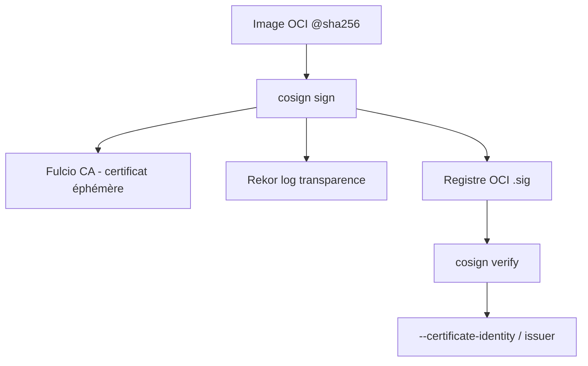

# sigstore/cosign

> Outil Sigstore pour signer et vérifier des conteneurs OCI et autres artefacts.

## Le problème
Signer des images de conteneurs et prouver leur provenance imposait PGP et une gestion de clés lourde. Les signatures détachées et l'air-gap compliquent la vérification.

## Ce que ça fait vraiment
Signature « keyless » par défaut via l'autorité Fulcio et le log de transparence Rekor (OIDC, certificat lié à l'email). Support aussi des clés matérielles/KMS et d'un keypair chiffré généré. Signe, vérifie et stocke des signatures dans un registre OCI. Vérification air-gap via bundle/trusted root. Attestations in-toto (DSSE). Signe aussi blobs, WASM, eBPF, Tekton bundles, Helm charts.

## Comment c'est branché


## Essayer
```shell
cosign sign $IMAGE
```
```shell
cosign verify $IMAGE --certificate-identity=$IDENTITY --certificate-oidc-issuer=$OIDC_ISSUER
```

## Coût et pièges
Gratuit. Signature keyless : l'email d'authentification est stocké de façon permanente dans les logs de transparence publics. Signer par digest (`@sha256:`), jamais par tag. Les signatures ne sont pas garbage-collectées avec l'image ; multi-signatures = race condition read-append-write.

## Ce que ce n'est pas
Pas un scanner de vulnérabilités : signature et vérification de provenance uniquement. Seulement ECDSA-P256/SHA256 pour ses propres clés.

## Alternatives
- Notary v2 : comparé dans une FAQ dédiée.
- containers/image signing : proche, mais PGP au lieu d'ECDSA.

## Pour toi
Standard de fait pour signer tes images de modèles/conteneurs dans un pipeline MLOps ; à adopter.
