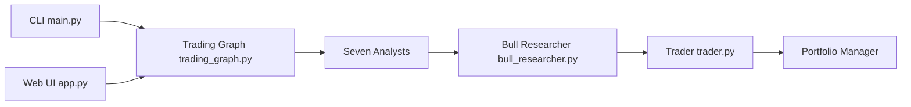

# simonlin1212/TradingAgents-astock

> Fork du cadre multi-agents TradingAgents adapté au marché actions chinois (A-share), pour la recherche et l'enseignement.

## Le problème
TradingAgents cible les marchés américains : données, analystes et règles de trading (T+0, sans limite de hausse) ne conviennent pas aux actions chinoises.

## Ce que ça fait vraiment
Sept analystes (marché, sentiment, news, fondamentaux + politique, flux « hot money », levées de lock-up) alimentent un débat haussier/baissier, un gestionnaire de recherche, un trader sous contraintes A-share (T+1, limites, lots), un débat de risque à trois puis un gestionnaire de portefeuille. Données gratuites (mootdx, Tencent, Eastmoney, Sina…). CLI, interface Streamlit, statistique de performance des décisions.

## Comment c'est branché


## Essayer
```bash
git clone https://github.com/simonlin1212/tradingagents-astock.git
cd tradingagents-astock
pip install -e .
tradingagents
tradingagents-web
```

## Coût et pièges
Chaque analyse fait 30 à 50 appels LLM facturés à ta clé (MiniMax, DeepSeek, OpenAI, Anthropic…). Eastmoney limite le débit : le code intègre un throttling. Mode optionnel via abonnement Claude Pro/Max, réservé à l'usage personnel.

## Ce que ce n'est pas
Pas un conseil en investissement ni un système de trading : aucun prix cible ni stop dans le code. L'outil de performance n'est pas un backtest ; sous 20 échantillons les ratios sont du bruit.

## Alternatives
- TauricResearch/TradingAgents : le projet amont, orienté marchés américains.

## Pour toi
À surveiller : utile comme étude d'orchestration multi-agents avec débats ; ne l'utilise pas comme signal de décision.

