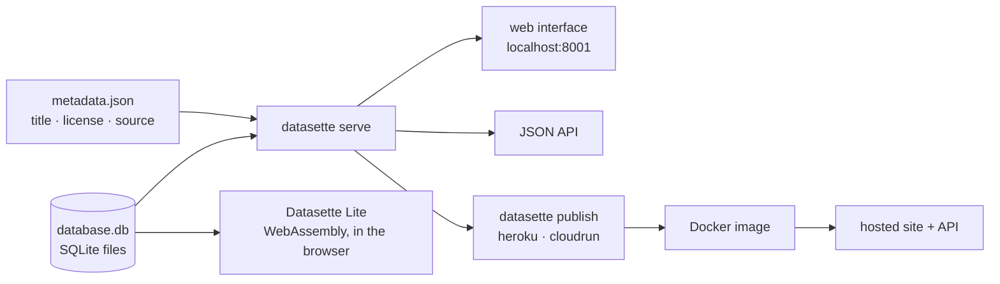

# simonw/datasette

> **Turns a SQLite file into a browsable website and a JSON API, with no code to write.**

## The problem

You end up with a SQLite database — a tool export, a scrape, a dataset published by a public
body — and nothing to show it with. Sharing the file assumes the other person installs a SQL
client; writing a small web app to consult it means rebuilding list pages, filters and
pagination for the hundredth time, plus a JSON API on top. The README explicitly targets people
who have data to share but are not web developers: data journalists, museum curators,
archivists, local governments, scientists and researchers.

## What it actually does

Datasette takes one or more SQLite files as arguments and starts a web server. The README gives
the central command, `datasette serve path/to/database.db`, which listens on port 8001; `serve`
is the default subcommand and can be omitted. The resulting interface browses tables — the
README's example points Datasette at Chrome's browsing history on macOS and opens
`/History/downloads` directly — and the same data is served as JSON through the API.

An optional metadata file, passed with `-m metadata.json`, carries the dataset's title, license,
license URL, source and source URL. That information is shown on the index page and in the
footer, and included in the JSON produced by the API — it is the project's provenance mechanism.

The `datasette publish` subcommand builds a Docker image containing the application and the
specified SQLite files, deploys it to a previously configured host — Heroku or Google Cloud Run
in the README — and returns the URL of the resulting website and API.

The project has separate documentation (docs.datasette.io), an official site, a live demo of the
`main` branch, a Discord and a newsletter. Datasette Lite is a variant packaged with WebAssembly
that runs entirely in the browser, with no Python web application server.

## How it is wired



No code-derived diagram exists for this repository: this one is reconstructed from the README
alone. The thing to note is that the input is always an already-built SQLite file, and that
`publish` is not a separate serving mode — it wraps the same `serve` command in a Docker image.

## Trying it

```bash
brew install datasette
```

Or, with Python:

```bash
pip install datasette
```

Then:

```bash
datasette serve path/to/database.db
```

The README's Chrome history example on macOS, and passing metadata:

```bash
datasette ~/Library/Application\ Support/Google/Chrome/Default/History --nolock
datasette serve fivethirtyeight.db -m metadata.json
```

Publishing:

```bash
datasette publish heroku database.db
datasette publish cloudrun database.db
```

## Cost and pitfalls

- **Python 3.10 or higher** is required per the README; `pip` and `pipx` are the announced
  routes, Homebrew on Mac, Docker through the documentation's detailed instructions.
- **Installation is free, hosting is not.** `datasette publish` deploys to Heroku or Google
  Cloud Run, which must be "configured" beforehand: account, billing and quotas are on you, and
  the README does not cover them.
- **Locked databases need `--nolock`**: the Chrome history example shows it — a SQLite file in
  use by another application cannot be read without that flag.
- **Publishing a database makes its data public.** The Docker image built by `publish` contains
  the SQLite files themselves: everything in the database ships with it.
- **One main maintainer.** The project is carried by Simon Willison; the ecosystem is broad but
  governance rests on a single person, which is the warning kept here.

## What it is not

- **It is not a database.** Datasette stores nothing: you must arrive with an already-built
  SQLite file. CSV-to-SQLite conversion, import and cleaning are outside the README's scope.
- **It is not a writing tool.** The README only describes exploring and publishing, never
  editing data from the interface.
- **It is not a host.** `publish` builds and pushes a Docker image to a service you have already
  configured; the account, the bill and the uptime stay with Heroku or Google Cloud Run.
- **It is not a visualisation tool**: the README speaks of an explorable site and an API, not of
  charts or dashboards.

## Alternatives

No comparable alternative in the catalogue: the lexically computed neighbours (`gogs/gogs` — a
Git forge, `bregman-arie/devops-exercises` — an exercise collection,
`cookiecutter/cookiecutter-django` — a Django project template, `evroon/bracket` — a tournament
manager) have nothing to do with publishing SQLite data. The only variant named in the README is
**Datasette Lite**, the same tool compiled to WebAssembly: prefer it when you want neither a
server nor a Python installation and accept running everything in the browser.

## For you

Useful as a near-zero-cost consultation layer over anything that ends up in SQLite: pipeline
outputs, one-off extracts, datasets to share with non-technical people. The effort-to-result
ratio is excellent as long as the data fits in a file and is read-only. Skip it if the source is
a warehouse, a transactional database, or a volume that cannot reasonably be copied into SQLite.
