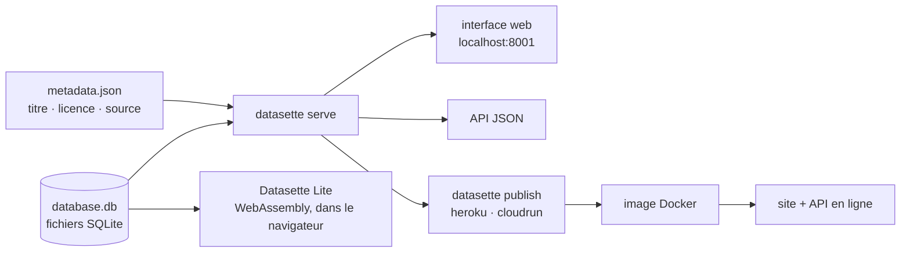

# simonw/datasette

> **Transforme un fichier SQLite en site web explorable et en API JSON, sans écrire de code.**

## Le problème

On a une base SQLite — export d'un outil, scrape, jeu de données publié par une administration —
et rien pour la montrer à quelqu'un d'autre. Partager le fichier suppose que le destinataire
installe un client SQL ; écrire une petite application web de consultation revient à refaire
pour la centième fois les mêmes pages de liste, de filtre et de pagination, plus une API JSON
par-dessus. Le README vise explicitement les gens qui ont des données à partager mais pas de
métier de développeur web : journalistes de données, conservateurs de musée, archivistes,
collectivités locales, scientifiques et chercheurs.

## Ce que ça fait vraiment

Datasette prend un ou plusieurs fichiers SQLite en argument et démarre un serveur web. Le
README donne la commande centrale, `datasette serve path/to/database.db`, qui écoute sur le
port 8001 ; `serve` est la sous-commande par défaut et peut être omise. L'interface obtenue
permet de parcourir les tables — l'exemple du README fait pointer Datasette sur l'historique de
Chrome sur macOS et ouvre directement `/History/downloads` — et les mêmes données sont servies
en JSON par l'API.

Un fichier de métadonnées facultatif, passé avec `-m metadata.json`, porte le titre, la licence,
l'URL de licence, la source et l'URL de source du jeu de données. Ces informations sont affichées
sur la page d'index et en pied de page, et incluses dans le JSON produit par l'API — c'est le
mécanisme de provenance du projet.

La sous-commande `datasette publish` construit une image Docker contenant l'application et les
fichiers SQLite indiqués, puis la déploie chez un hébergeur configuré au préalable — Heroku ou
Google Cloud Run dans le README — et renvoie l'URL du site et de l'API résultants.

Le projet a une documentation séparée (docs.datasette.io), un site officiel, une démonstration
en ligne de la branche `main`, un Discord et une lettre d'information. Datasette Lite est une
variante empaquetée en WebAssembly qui tourne entièrement dans le navigateur, sans serveur
d'application Python.

## Comment c'est branché



Aucun diagramme tiré du code n'existe pour ce dépôt : ce schéma est reconstruit depuis le seul
README. Le point à retenir est que l'entrée est toujours un fichier SQLite déjà constitué, et
que `publish` n'est pas un mode de service distinct — il emballe la même commande `serve` dans
une image Docker.

## Essayer

```bash
brew install datasette
```

Ou, avec Python :

```bash
pip install datasette
```

Puis :

```bash
datasette serve path/to/database.db
```

L'exemple de lecture de l'historique Chrome sur macOS, et le passage de métadonnées :

```bash
datasette ~/Library/Application\ Support/Google/Chrome/Default/History --nolock
datasette serve fivethirtyeight.db -m metadata.json
```

Publication :

```bash
datasette publish heroku database.db
datasette publish cloudrun database.db
```

## Coût et pièges

- **Python 3.10 ou plus** est exigé par le README ; `pip` et `pipx` sont les voies annoncées,
  Homebrew sur Mac, Docker via les instructions détaillées de la documentation.
- **L'installation est gratuite, l'hébergement non.** `datasette publish` déploie chez Heroku ou
  Google Cloud Run, qui doivent être « configurés » au préalable : compte, facturation et quotas
  sont à ta charge, le README ne les couvre pas.
- **Les bases verrouillées demandent `--nolock`** : l'exemple de l'historique Chrome le montre,
  un fichier SQLite en cours d'utilisation par une autre application n'est pas lisible sans ce
  drapeau.
- **Mettre une base en ligne rend ses données publiques.** L'image Docker construite par
  `publish` contient les fichiers SQLite eux-mêmes : tout ce qui est dans la base part avec.
- **Un seul mainteneur principal.** Le projet est porté par Simon Willison ; l'écosystème est
  large mais la gouvernance tient à une personne, c'est l'alerte retenue.

## Ce que ce n'est pas

- **Ce n'est pas une base de données.** Datasette ne stocke rien : il faut arriver avec un
  fichier SQLite déjà construit. La conversion CSV → SQLite, l'import, le nettoyage sont hors
  périmètre du README.
- **Ce n'est pas un outil d'écriture.** Le README ne décrit que l'exploration et la publication,
  jamais la modification des données depuis l'interface.
- **Ce n'est pas un hébergeur.** `publish` fabrique et pousse une image Docker vers un service
  que tu as déjà configuré ; le compte, la facture et la disponibilité restent chez Heroku ou
  Google Cloud Run.
- **Ce n'est pas un outil de visualisation** : le README parle de site explorable et d'API, pas
  de graphiques ni de tableaux de bord.

## Alternatives

Aucune alternative comparable dans le catalogue : les voisins proposés par le lexique
(`gogs/gogs` — forge Git, `bregman-arie/devops-exercises` — recueil d'exercices,
`cookiecutter/cookiecutter-django` — gabarit de projet Django, `evroon/bracket` — gestionnaire
de tournois) n'ont aucun rapport avec la publication de données SQLite. La seule variante
nommée dans le README est **Datasette Lite**, le même outil compilé en WebAssembly : à préférer
quand on ne veut ni serveur ni installation Python et qu'on accepte de tout faire tourner dans
le navigateur.

## Pour toi

Utile comme couche de consultation à coût quasi nul sur tout ce qui finit en SQLite : sorties de
pipeline, extractions ponctuelles, jeux de données à partager avec des non-techniciens. Le
rapport effort/résultat est excellent tant que la donnée tient dans un fichier et qu'on la
consulte en lecture seule. À écarter si la source est un entrepôt, une base transactionnelle ou
un volume qui ne se recopie pas raisonnablement en SQLite.
