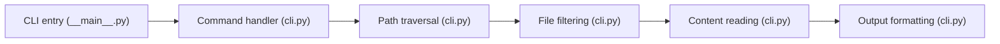

# simonw/files-to-prompt

> Petit utilitaire en ligne de commande qui concatène des fichiers en un seul prompt pour un LLM.

## Le problème
Donner à un LLM le contenu de tout un dossier oblige à copier-coller fichier par fichier, avec leurs chemins.

## Ce que ça fait vraiment
Parcourt fichiers et dossiers (arguments ou stdin), filtre par extension, motifs `--ignore`, fichiers cachés et `.gitignore`, lit chaque fichier et l'écrit précédé de son chemin. Trois formats : texte avec séparateurs `---`, XML Claude (`--cxml`) ou blocs Markdown (`--markdown`) ; numéros de ligne en option, sortie vers un fichier avec `-o`.

## Comment c'est branché


## Essayer
```bash
pip install files-to-prompt
files-to-prompt path/to/directory -e py --cxml
find . -name "*.py" -print0 | files-to-prompt --null
files-to-prompt path/to/directory -o output.txt
```

## Coût et pièges
Gratuit, aucun appel réseau décrit. Attention à la taille de la sortie : elle peut dépasser la fenêtre de contexte de ton modèle.

## Ce que ce n'est pas
Pas un outil de RAG ni de sélection intelligente : il concatène, c'est tout. Dernier push en février 2025, 31 issues ouvertes.

## Alternatives
Aucune alternative nommée dans le README.

## Pour toi
À adopter : un outil minuscule et fiable pour préparer un contexte de code ; sa stabilité compense l'absence d'activité récente.

