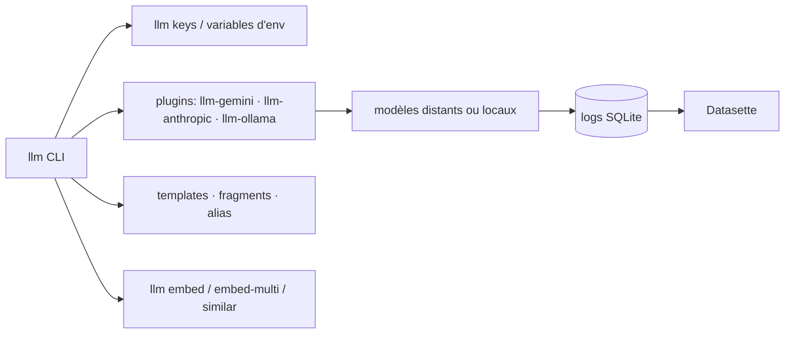

# simonw/llm

> Outil en ligne de commande et bibliothèque Python pour interroger des dizaines de modèles.

## Le problème
Chaque fournisseur a son SDK et son format ; comparer deux modèles sur le même prompt demande
d'écrire deux scripts, et rien ne garde trace de ce qui a été demandé.

## Ce que ça fait vraiment
`llm` lance des prompts depuis la ligne de commande contre OpenAI, Claude, Gemini, Qwen, Gemma,
Kimi, DeepSeek, Mistral et des dizaines d'autres, en API distante comme en local. Il stocke prompts
et réponses dans SQLite, génère et stocke des embeddings, extrait du contenu structuré depuis texte
et images (schémas), et donne aux modèles la capacité d'exécuter des outils. Les fournisseurs
s'ajoutent par plugins (`llm install llm-gemini`, `llm-anthropic`, `llm-ollama`) ; les clés se
gèrent par `llm keys set`. Des templates, fragments et alias rendent les invocations réutilisables,
et un magasin de messages structure threads, tours, messages et parties.

## Comment c'est branché


## Essayer
```bash
pip install llm
llm keys set openai
llm "Ten fun names for a pet pelican"
cat myfile.py | llm -s "Explain this code"
llm install llm-anthropic
llm -m claude-sonnet-5 'Impress me with wild facts about turnips'
llm chat -m gpt-4.1
uvx llm openai endpoint http://localhost:1234/v1 -m google/gemma-4-12b "What is the capital of France?"
```

## Coût et pièges
L'outil est gratuit, les appels d'API non : chaque fournisseur facture ses tokens et exige sa clé.
Le README signale une note d'avertissement sur l'installation Homebrew et PyTorch. Les modèles
locaux passent par un plugin (Ollama) et consomment ta propre machine.

## Ce que ce n'est pas
Ce n'est pas un framework d'agents ni un orchestrateur : c'est une CLI et une bibliothèque, avec
outils et schémas en complément. Ce n'est pas non plus un fournisseur de modèles — tout passe par
des plugins vers des services ou des runtimes existants.

## Alternatives
Le README cite les outils voisins du même auteur : `strip-tags`, `ttok` et `Symbex`, qui se
combinent à `llm` en ligne de commande plutôt qu'ils ne le remplacent.

## Pour toi
L'outil à installer en premier : historiser tous tes prompts en SQLite et pouvoir les rejouer sur un
autre modèle en changeant un drapeau, c'est ce qui manque à la plupart des workflows.
