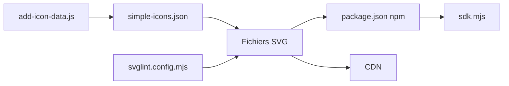

# simple-icons/simple-icons

> Plus de 3 400 icônes SVG de marques, en paquet npm et via CDN, pour développeurs web.

## Le problème
Afficher le logo d'une marque sans le chercher, le nettoyer et le recolorer soi-même.

## Ce que ça fait vraiment
Une collection de fichiers SVG avec métadonnées (titre, slug, couleur hexadécimale, source, licence éventuelle). Accessible par téléchargement, par CDN (jsDelivr, unpkg, et cdn.simpleicons.org avec couleur), par npm, par Packagist ou en police. Des extensions et bibliothèques tierces (React, Vue, Python…) sont listées.

## Comment c'est branché


## Essayer
```bash
npm install simple-icons
composer require simple-icons/simple-icons
```
```js
import {siSimpleicons} from 'simple-icons';
```

## Coût et pièges
Gratuit. Le README demande de lire l'avertissement juridique avant usage. Épingler une version majeure sur le CDN (`@v16`), sinon une icône retirée donne une 404 avec `@latest`.

## Ce que ce n'est pas
Pas un droit d'utiliser les logos : chaque marque garde ses droits. Le dépôt est sous CC0, mais pas les marques elles-mêmes.

## Alternatives
Aucune alternative nommée dans le README.

## Pour toi
Surveiller : pratique pour un rapport ou un dashboard montrant des logos d'outils ; respecte les consignes juridiques de chaque marque.

