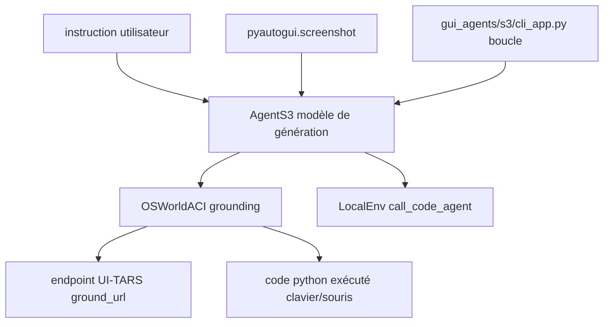

# simular-ai/Agent-S

> Agent qui pilote souris, clavier et écran d'un vrai poste, pour recherche et automatisation bureautique.

## Le problème
Automatiser une application sans API impose d'écrire un script par application, fragile au moindre changement d'interface.
Les benchmarks d'agents « computer use » restaient loin du niveau humain, donc inexploitables en pratique.

## Ce que ça fait vraiment
Prend une instruction en langage naturel, lit une capture d'écran, puis clique, tape et défile jusqu'au résultat.
Deux modèles distincts : un modèle de génération (gpt-5 recommandé) et un modèle de *grounding* qui traduit une intention en coordonnées (UI-TARS-1.5-7B recommandé).
Un agent de réflexion facultatif assiste l'agent de travail ; `--enable_local_env` ajoute l'exécution de Python et Bash locaux.
Tourne sur macOS, Windows et Linux, en CLI (`agent_s`) ou via le SDK `gui_agents` (`AgentS3`, `OSWorldACI`).

## Comment c'est branché


## Essayer
```bash
pip install gui-agents
pip install -e .
brew install tesseract
export OPENAI_API_KEY=<YOUR_API_KEY>
agent_s --provider openai --model gpt-5-2025-08-07 --ground_provider huggingface --ground_url http://localhost:8080 --ground_model ui-tars-1.5-7b --grounding_width 1920 --grounding_height 1080
```

## Coût et pièges
Deux facturations : le modèle principal (OpenAI, Anthropic…) et l'endpoint de grounding, à héberger ou à louer (Hugging Face Inference Endpoints).
Écran unique obligatoire. `--enable_local_env` exécute du Python et du Bash arbitraires avec vos droits : à réserver à un environnement de confiance.

## Ce que ce n'est pas
Pas le produit : le README dirige vers Sai, l'agent hébergé de Simular, pour un usage de production.
Pas plug-and-play : sans modèle de grounding servi quelque part, rien ne fonctionne, et `grounding_width/height` doivent correspondre au modèle.
Pas sûr par construction — le README le dit : l'agent exécute du code Python pour contrôler la machine.

## Alternatives
- GTA1 w/ GPT-5 : état de l'art antérieur cité dans les résultats OSWorld.
- Sai : la version hébergée du même éditeur, si vous cherchez un produit et pas un cadre de recherche.

## Pour toi
À suivre pour les tâches sans API ; le double coût modèle + grounding le rend cher pour un usage quotidien.
