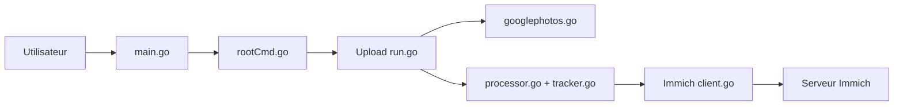

# simulot/immich-go

> Outil en ligne de commande pour envoyer de grosses collections de photos vers un serveur Immich auto-hébergé.

## Le problème
Migrer des dizaines de milliers de photos (Google Photos Takeout, iCloud, dossiers) vers Immich à la main perd albums, dates et métadonnées.

## Ce que ça fait vraiment
Sous-commandes `upload from-folder`, `from-google-photos`, `from-immich`, `from-picasa`, `from-icloud`, plus `archive from-immich`. Détecte les doublons, empile les rafales et paires RAW+JPEG, crée albums et tags, ignore les fichiers parasites (`.DS_Store`, `@eaDir/`…). Peut suspendre les tâches de fond d'Immich pendant l'envoi.

## Comment c'est branché


## Essayer
```bash
immich-go upload from-folder --server=http://your-ip:2283 --api-key=your-api-key /path/to/your/photos
immich-go upload from-google-photos --server=http://your-ip:2283 --api-key=your-api-key /path/to/takeout-*.zip
immich-go archive from-immich --from-server=http://your-ip:2283 --from-api-key=your-api-key --write-to-folder=/path/to/archive
```

## Coût et pièges
Gratuit. Il faut un serveur Immich et une clé d'API avec les bonnes permissions. Le README avertit : version précoce, peu testée, garder une copie des fichiers. La suppression de `ReplaceAsset` (v0.32.0) est un changement cassant.

## Ce que ce n'est pas
Pas un gestionnaire de photos : c'est un importeur pour Immich seulement. Rien à voir avec la reconnaissance d'images.

## Alternatives
Aucune alternative nommée dans le README.

## Pour toi
Ignorer : utilité réelle uniquement si tu migres une photothèque vers Immich, sans lien avec un travail data/IA.

