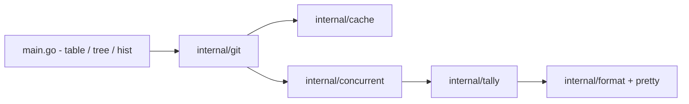

# sinclairtarget/git-who

> Outil en ligne de commande qui montre qui a écrit quoi dans un dossier ou un sous-système Git.

## Le problème
`git blame` ne répond que ligne par ligne ; on ignore qui connaît vraiment un module entier.

## Ce que ça fait vraiment
Trois sous-commandes : `table` (contributions par auteur), `tree` (arborescence annotée de l'auteur principal), `hist` (chronologie par année ou par mois). Les filtres : chemin, branche, plage de révisions, `--author`, `--since`. Métriques : commits, fichiers, lignes. Il respecte `.mailmap` et `.git-blame-ignore-revs`, et met en cache par dépôt sous `XDG_CACHE_HOME`. Écrit en Go, il parcourt l'historique en parallèle.

## Comment c'est branché


## Essayer
```bash
brew install git-who
go install github.com/sinclairtarget/git-who@latest
git who
git who tree Parser/
git who hist v3.12.0..
```

## Coût et pièges
Gratuit. Le cache est désactivable avec `GIT_WHO_DISABLE_CACHE=1`. Les commits de fusion ne sont pas comptés par défaut ; un fichier renommé compte deux fois.

## Ce que ce n'est pas
Ce n'est pas un remplaçant de `git blame` : il mesure qui a fait le plus de modifications, pas qui a écrit chaque ligne. Il mesure l'activité, pas la qualité.

## Alternatives
`git blame` (nommé dans le README) pour l'attribution ligne par ligne.

## Pour toi
À adopter : outil léger et gratuit pour repérer les référents d'un module avant une reprise ou une revue, y compris sur tes dépôts MLOps.

