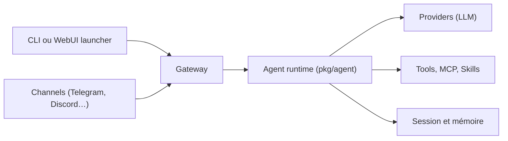

# sipeed/picoclaw

> Assistant IA personnel en Go, léger, exécutable sur cartes Linux à quelques dizaines de dollars.

## Le problème
Les assistants IA autonomes consomment beaucoup de mémoire et de temps de démarrage, ce qui exclut les petites cartes embarquées.

## Ce que ça fait vraiment
Un binaire Go unique qui exécute un agent : commandes (agent, gateway, mcp, skills, cron), passerelle vers 19 canaux de discussion (Telegram, Discord, Slack, WhatsApp…), plus de 30 fournisseurs LLM y compris Ollama et vLLM en local. Il gère MCP, skills en SKILL.md, tâches planifiées et routage de modèles selon la requête. Une interface WebUI (launcher) configure fournisseur et canal.

## Comment c'est branché


## Essayer
```bash
picoclaw-launcher
picoclaw onboard
picoclaw agent -m "What is 2+2?"
picoclaw gateway
```

## Coût et pièges
Clé d'API du fournisseur à ta charge, sauf modèle local (Ollama, vLLM). Le README avertit : pas de déploiement en production avant la v1.0, failles possibles, et les builds récents consomment 10 à 20 Mo de RAM au lieu de moins de 10 Mo annoncés.

## Ce que ce n'est pas
Pas un fork d'OpenClaw ni de NanoBot, selon le README. Pas de jeton ni de cryptomonnaie officiels : le domaine officiel est picoclaw.io.

## Alternatives
- OpenClaw : comparé dans le README, plus gourmand en RAM.
- NanoBot : Python, plus lent au démarrage.

## Pour toi
À surveiller : un agent multi-fournisseurs avec MCP qui tient sur une carte est intéressant pour l'IA embarquée, mais encore expérimental.

