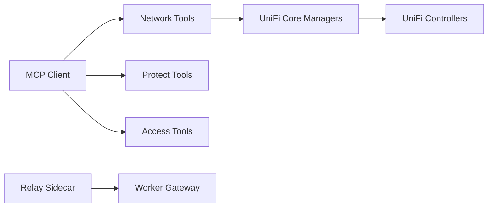

# sirkirby/unifi-mcp

> Serveurs MCP pour piloter des contrôleurs UniFi Network, Protect et Access depuis un assistant IA.

## Le problème
Administrer un réseau UniFi, ses caméras et ses accès exige de naviguer dans plusieurs interfaces.

## Ce que ça fait vraiment
Trois serveurs MCP (194 outils Network, 62 Protect, 37 Access) parlent aux contrôleurs locaux. Toute modification passe par un aperçu puis confirmation. Redaction par défaut des secrets. Option : serveur d'API REST et GraphQL bêta, et relais cloud via Cloudflare Worker. Modes de découverte paresseux ou complet.

## Comment c'est branché


## Essayer
```bash
uvx unifi-network-mcp@latest
uvx unifi-protect-mcp@latest
uvx unifi-access-mcp@latest
```

## Coût et pièges
Compte administrateur local sans MFA requis (pas de SSO Ubiquiti). Le HTTP MCP est non authentifié : usage local de confiance. Le relais cloud utilise Cloudflare.

## Ce que ce n'est pas
Pas un outil pour d'autres marques. Donner l'écriture à un agent sur ton pare-feu demande de rester en mode confirmation.

## Alternatives
Aucune alternative nommée dans le README.

## Pour toi
À ignorer pour un travail data/IA : ne sert que si tu administres un parc UniFi ; sinon sans objet.

