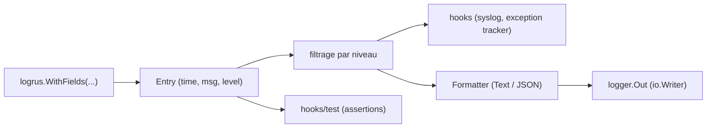

# sirupsen/logrus

> Logger structuré pour Go, compatible avec le logger de la bibliothèque standard.

## Le problème
Un message `printf` concaténé n'est pas analysable : les valeurs utiles sont noyées dans la phrase.
Migrer d'un logger standard vers un logger structuré casse habituellement tous les appels existants.

## Ce que ça fait vraiment
API identique à `log` : remplacer l'import suffit pour récupérer la journalisation structurée.
`WithFields` attache des paires clé-valeur ; une `Entry` réutilisable porte les champs communs (request_id, user_ip).
Deux formateurs fournis — texte coloré en TTY, logfmt sinon, et JSON — plus des formateurs tiers (GELF, logstash, redactrus…).
Sept niveaux (Trace à Panic), hooks par niveau (syslog, Airbrake), handlers exécutés avant `os.Exit(1)`, hook de test pour les assertions.

## Comment c'est branché


## Essayer
```bash
go test -bench=ReportCaller
```

## Coût et pièges
`SetReportCaller(true)` ajoute le nom de méthode mais coûte entre 20 et 40 % de surcoût mesuré.
Le nom d'organisation est passé en minuscules : importer `github.com/sirupsen/logrus`, pas la variante majuscule.

## Ce que ce n'est pas
Ce n'est pas un projet qui évolue : il est en mode maintenance, sécurité et correctifs seulement, sans v2 prévue.
Ce n'est pas un gestionnaire de rotation : la rotation est déléguée à `logrotate(8)` par choix de conception.
Ce n'est pas conscient de l'environnement : distinguer dev et production est à la charge de l'application.

## Alternatives
rs/zerolog, uber-go/zap, apex/log : recommandés par l'auteur lui-même comme successeurs modernes.
Go `log/slog` : la direction de l'écosystème, l'interopérabilité avec lui étant la seule évolution encore prévue.

## Pour toi
À ignorer : l'auteur renvoie lui-même vers zerolog, zap ou `log/slog`.
