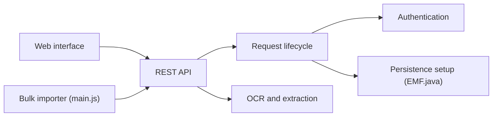

# sismics/docs

> Teedy : gestion documentaire légère et auto-hébergée avec OCR et recherche plein texte.

## Le problème
Classer, retrouver et partager des documents (PDF, Office, images) sans service cloud.

## Ce que ça fait vraiment
Application Java (WAR) avec interface web, API REST et client Android : OCR (Tesseract), recherche plein texte, tags imbriqués, métadonnées Dublin Core, versions de fichiers, chiffrement AES 256 bits, workflows, groupes et permissions, 2FA, LDAP, webhooks, import d'e-mails et de dossiers. Annoncée testée jusqu'à un million de documents.

## Comment c'est branché

Le traitement documentaire n'est pas visible dans les extraits d'architecture.

## Essayer
```bash
docker run -d -p 8080:8080 -v ./docs/data:/data -e DOCS_BASE_URL=https://docs.example.com sismics/docs:v1.11
```

## Coût et pièges
Gratuit. Mot de passe admin par défaut « admin » à changer. La base H2 embarquée est réservée aux tests : PostgreSQL pour la production. L'image `latest` suit master et peut être instable.

## Ce que ce n'est pas
Pas un outil de GED pour entreprise avec support : projet communautaire sous GPL-2.0.

## Alternatives
Aucune alternative nommée dans le README.

## Pour toi
À surveiller : base documentaire d'appoint avec OCR si tu veux auto-héberger ; sans lien direct avec l'IA.

