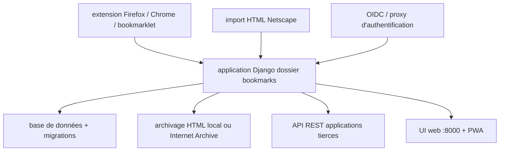

# sissbruecker/linkding

> Gestionnaire de marque-pages auto-hébergé, minimal et rapide, installé par Docker.

## Le problème
Les marque-pages du navigateur ne se partagent pas, ne s'annotent pas et disparaissent avec le profil.
Les services en ligne équivalents imposent un compte tiers et la perte de contrôle des données.

## Ce que ça fait vraiment
Range les marque-pages par tags, avec édition en masse, notes Markdown et fonction « à lire plus tard ».
Récupère automatiquement titre, description et icône des pages, et archive les sites en HTML local ou sur Internet Archive.
Partage entre utilisateurs ou avec des invités ; import/export au format HTML Netscape ; installable en PWA.
API REST pour applications tierces, SSO via OIDC ou proxy d'authentification, panneau d'administration Django.

## Comment c'est branché


## Essayer
```bash
make init
uv run manage.py createsuperuser --username=joe --email=joe@example.com
make frontend
make serve
make test
make lint
make format
```

## Coût et pièges
Gratuit ; le coût est l'hébergement du conteneur. Pour le développement il faut Python 3.13, uv et Node.js.
Piège : le README renvoie l'installation de production à la documentation externe linkding.link — les commandes ci-dessus sont celles du développement.

## Ce que ce n'est pas
Pas un lecteur de contenu : l'archivage garde la page, il n'en fait pas une bibliothèque de lecture.
Pas un service géré, sauf si vous passez par une des options d'hébergement citées.
Pas extensible côté serveur : c'est du Django standard, à modifier soi-même.

## Alternatives
- Projets communautaires listés dans le README (applications mobiles, extensions, bibliothèques) : compléments, pas substituts.

## Pour toi
Bon pour archiver ta veille avec tags et notes, sous ton contrôle ; aucun rapport direct avec la data.
