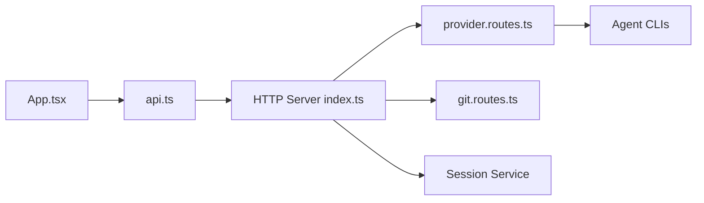

# siteboon/claudecodeui

> Interface web et mobile pour piloter Claude Code, Cursor CLI et Codex sur ses projets.

## Le problème
Les agents de code en CLI exigent un terminal ouvert ; difficile de les reprendre depuis un téléphone ou de voir tout l'historique.

## Ce que ça fait vraiment
Serveur Node avec client React : chat, terminal intégré, explorateur de fichiers, explorateur Git, sessions retrouvées automatiquement dans `~/.claude`. Lit et écrit la config MCP de Claude Code. Système de plugins, TaskMaster optionnel, application de bureau Electron, offre cloud hébergée.

## Comment c'est branché


## Essayer
```bash
npx @cloudcli-ai/cloudcli
npm install -g @cloudcli-ai/cloudcli
cloudcli
```
Puis `http://localhost:3001`.

## Coût et pièges
Node 22+. Il faut ses propres abonnements Claude, Cursor ou Codex. Offre cloud à partir de 7 €/mois. Modifie la config `~/.claude` locale. Outils désactivés par défaut.

## Ce que ce n'est pas
Pas un agent : il fournit l'environnement, pas l'IA. Le mode Docker Sandbox est expérimental.

## Alternatives
- Claude Code Remote Control : comparé dans la FAQ ; une seule session active, machine allumée.

## Pour toi
À surveiller : utile si tu laisses des agents travailler à distance, mais AGPL-3.0 et accès en écriture à ta config ; teste en bac à sable.

