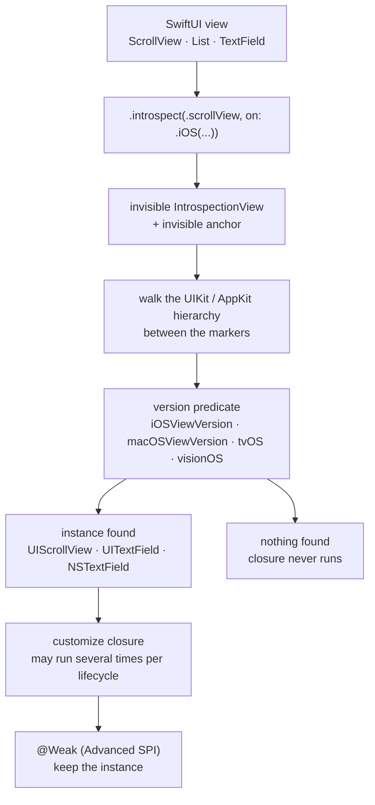

# siteline/swiftui-introspect

> **Reach the UIKit or AppKit view hiding behind a SwiftUI view, for Apple platform developers.**

## The problem

SwiftUI exposes only a fraction of what UIKit and AppKit allow: turning off a `ScrollView`'s
bounce, tinting a navigation bar, or touching the `UITextField` under a `TextField` have no
native modifier. Without a way down to the underlying layer, you either rebuild the component
by hand or drop the requirement.

## What it actually does

The library inserts an invisible `IntrospectionView` above the target view and an invisible
anchor below it, then walks the UIKit/AppKit hierarchy between the two markers until it finds
the expected instance. The modifier
`.introspect(.scrollView, on: .iOS(.v17, .v18, .v26, .v27)) { … }` hands that instance to a
closure.

Version targeting is explicit and mandatory: underlying types can change between major OS
releases, so every covered version is spelled out. Range predicates (`.iOS(.v13...)`) exist for
library authors, with the caveat that a range reuses its lower bound's selector.

Around fifty view types are covered (`List`, `ScrollView`, `NavigationStack`, `TextField`,
`Table`, `TabView`, `Toggle`, `.sheet`, `.searchable`, `Window`…), and a table lists the views
that **cannot** be introspected for lack of an underlying view: `Text`, `Image`, `Color`, the
stacks, `Chart`. An `@_spi(Advanced)` surface lets you declare your own introspectable type and
offers a `@Weak` property wrapper to hold the instance outside the closure without a retain
cycle.

The README states no private APIs are used: public traversal methods, no forced casts, and
`.introspect` is simply skipped when the expected view is not found.

## How it is wired

No code-derived diagram exists for this repository; the graph below is rebuilt from the README
alone.



## Trying it

Add the Swift Package Manager dependency, then link it to the target:

```bash
# README: no shell install command — everything goes through Package.swift
```

```swift
.package(url: "https://github.com/siteline/swiftui-introspect", from: "27.0.0"),

.product(name: "SwiftUIIntrospect", package: "swiftui-introspect"),
```

To work on the repository itself, these are the only shell commands the README documents:

```bash
mise install
mise exec -- hk install --mise
```

## Cost and gotchas

- **Free, no API key, no third-party service, no Docker**: it is a Swift package; the cost is
  Apple tooling, which the README does not quantify.
- **The real cost is version upkeep**: every covered OS version is written by hand in the call.
  A new major iOS or macOS release is not introspected until you add it — by design.
- **The closure may run multiple times** during the view's lifecycle: the README asks for
  idempotent code, forbids mutating SwiftUI state from inside (wrap in `DispatchQueue.main.async`
  if you must), and warns about capturing `self`, a memory-leak source.
- **Silent failure**: if the expected UIKit/AppKit view is not found, nothing happens and nothing
  warns you. An internal Apple change shows up as a customization that quietly disappears.
- **Library authors** should declare a range spanning at least the last two major versions
  (`"26.0.0"..<"28.0.0"`) to avoid resolution conflicts in apps that pull the dependency through
  several paths.
- **Deliberately frozen project**: the README says it is "essentially finished" — no new features,
  only newer platform versions and view types. Hence the alert kept: upstream activity is low by
  construction.

## What it is not

- **Not a component library**: it adds no view, no style, no behavior. It hands you a pointer to
  the UIKit/AppKit object and stops there; what you do next is UIKit work, not this project's.
- **Not a universal escape hatch**: a README table lists views that cannot be introspected for
  lack of an underlying view — `Text`, `Image`, `Color`, the stacks, `Chart`. No future release
  will change that.
- **Not platform-version agnostic**: the contract is tied to individually named OS versions, and
  behavior verified on iOS 17 is not guaranteed on iOS 18.

## Alternatives

| | When to prefer it |
|---|---|
| **SwiftUIX/SwiftUIX** | The closest catalog neighbor: it fills SwiftUI's gaps by *adding* views and modifiers. Prefer it when a component is missing; prefer swiftui-introspect when the component exists but one setting is not exposed. |
| **SwifterSwift/SwifterSwift** | Catalog neighbor: a collection of convenience extensions over standard and UIKit types. Prefer it to shorten UIKit code you already wrote, not to reach inside a SwiftUI view. |

`pointfreeco/swift-composable-architecture` and `XcodesOrg/XcodesApp`, the other neighbors, are
not comparable: one is a state architecture, the other an Xcode version manager. The projects
named in the README (`swiftui-navigation-transitions`, `PopupView`, `CustomKeyboardKit`) are
consumers of the library, not replacements.

## For you

Skip it as a data / AI / MLOps profile: nothing here touches data, models or deployment, and the
subject — patching SwiftUI's gaps via UIKit — does not transfer. Worth a look only if you ship a
native Apple app and an interface detail is blocking you.
