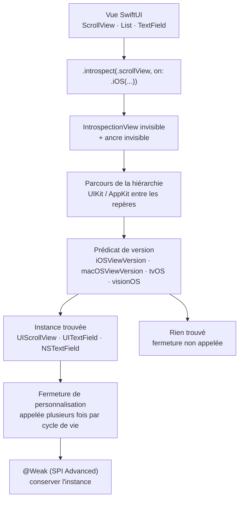

# siteline/swiftui-introspect

> **Atteindre la vue UIKit ou AppKit cachée derrière une vue SwiftUI, pour les développeurs Apple.**

## Le problème

SwiftUI n'expose qu'une fraction des réglages disponibles dans UIKit et AppKit : désactiver le
rebond d'un `ScrollView`, colorer une barre de navigation, toucher au `UITextField` sous un
`TextField` n'ont pas de modificateur natif. Sans passage par la couche sous-jacente, il reste
à réécrire le composant à la main ou à renoncer au réglage.

## Ce que ça fait vraiment

La bibliothèque insère une `IntrospectionView` invisible au-dessus de la vue visée et une
ancre invisible en dessous, puis parcourt la hiérarchie UIKit/AppKit entre les deux repères
jusqu'à trouver l'instance attendue. Le modificateur `.introspect(.scrollView, on: .iOS(.v17, .v18, .v26, .v27)) { … }`
livre alors cette instance dans une fermeture.

Le ciblage de version est explicite et obligatoire : les types sous-jacents peuvent changer
d'une version majeure d'OS à l'autre, donc chaque version couverte s'écrit. Des prédicats de
plage (`.iOS(.v13...)`) existent pour les auteurs de bibliothèques, avec l'avertissement que
la plage réutilise le sélecteur de sa borne basse.

Le catalogue couvre une cinquantaine de types de vues (`List`, `ScrollView`, `NavigationStack`,
`TextField`, `Table`, `TabView`, `Toggle`, `.sheet`, `.searchable`, `Window`…) et un tableau
liste explicitement les vues **impossibles** à introspecter (`Text`, `Image`, `Color`, les
`Stack`, `Chart`), faute de vue sous-jacente. Une SPI `@_spi(Advanced)` permet de déclarer son
propre type introspectable et offre un attribut `@Weak` pour conserver l'instance hors de la
fermeture sans créer de cycle de rétention.

Le README affirme que le procédé n'utilise aucune API privée : lecture par méthodes publiques,
pas de conversion de type forcée, et `.introspect` est simplement ignoré si la vue attendue
n'est pas trouvée.

## Comment c'est branché

Aucun diagramme tiré du code n'existe pour ce dépôt : ce schéma est reconstruit depuis le seul
README.



## Essayer

Ajouter la dépendance Swift Package Manager, puis la lier à la cible :

```bash
# README : pas de commande shell d'installation, tout passe par Package.swift
```

```swift
.package(url: "https://github.com/siteline/swiftui-introspect", from: "27.0.0"),

.product(name: "SwiftUIIntrospect", package: "swiftui-introspect"),
```

Pour travailler sur le dépôt lui-même, le README donne les seules commandes shell
documentées :

```bash
mise install
mise exec -- hk install --mise
```

## Coût et pièges

- **Gratuit, sans clé d'API, sans service tiers, sans Docker** : c'est un paquet Swift, le
  coût est un outillage Apple (non chiffré par le README).
- **Le vrai coût est la maintenance de version** : chaque version d'OS couverte s'écrit à la
  main dans l'appel. Une nouvelle version majeure d'iOS ou macOS n'est pas introspectée tant
  qu'on ne l'a pas ajoutée, par décision de conception.
- **La fermeture peut être appelée plusieurs fois** pendant le cycle de vie de la vue : le
  README demande du code idempotent, interdit de modifier l'état SwiftUI depuis l'intérieur
  (sinon `DispatchQueue.main.async`) et met en garde contre la capture de `self`, source de
  fuites mémoire.
- **Échec silencieux** : si la vue UIKit/AppKit attendue n'est pas trouvée, rien ne se passe et
  rien ne prévient. Un changement d'implémentation interne d'Apple se manifeste par une
  personnalisation qui disparaît, pas par une erreur.
- **Pour les auteurs de bibliothèques** : déclarer une plage couvrant au moins les deux
  dernières versions majeures (`"26.0.0"..<"28.0.0"`), sous peine de conflit de résolution
  chez les applications qui tirent la dépendance par plusieurs chemins.
- **Projet volontairement figé** : le README annonce qu'il est « essentiellement terminé »,
  qu'aucune fonctionnalité nouvelle ne sera ajoutée, seulement des versions de plateformes et
  des types de vues. D'où l'alerte retenue : l'activité amont est faible par construction.

## Ce que ce n'est pas

- **Ce n'est pas une bibliothèque de composants** : elle n'ajoute aucune vue, aucun style, aucun
  comportement. Elle donne un pointeur vers l'objet UIKit/AppKit et s'arrête là ; tout ce qu'on
  en fait relève de UIKit, pas du projet.
- **Ce n'est pas un contournement universel** : un tableau du README liste les vues qu'il est
  impossible d'introspecter faute de vue sous-jacente — `Text`, `Image`, `Color`, les `Stack`,
  `Chart`. Aucune version future ne les rendra accessibles.
- **Ce n'est pas indépendant de la plateforme** : le contrat est rattaché à des versions d'OS
  nommées une par une, et un comportement validé sur iOS 17 n'est pas garanti sur iOS 18.

## Alternatives

| | Quand le préférer |
|---|---|
| **SwiftUIX/SwiftUIX** | Voisin du catalogue, le plus proche : il comble les manques de SwiftUI en *ajoutant* des vues et des modificateurs. À préférer quand on veut un composant qui manque ; swiftui-introspect à préférer quand le composant existe mais qu'un réglage précis n'est pas exposé. |
| **SwifterSwift/SwifterSwift** | Voisin du catalogue : recueil d'extensions de commodité sur les types standard et UIKit. À préférer pour raccourcir du code UIKit déjà écrit, pas pour atteindre l'intérieur d'une vue SwiftUI. |

`pointfreeco/swift-composable-architecture` et `XcodesOrg/XcodesApp`, les autres voisins, ne
sont pas comparables : l'un est une architecture d'état, l'autre un gestionnaire de versions
d'Xcode. Les projets nommés dans le README (`swiftui-navigation-transitions`, `PopupView`,
`CustomKeyboardKit`) sont des consommateurs de la bibliothèque, pas des remplaçants.

## Pour toi

À ignorer pour un profil data / IA / MLOps : rien ici ne touche aux données, aux modèles ni au
déploiement, et le sujet — combler les trous de SwiftUI côté UIKit — ne se transpose pas. Ne
vaut le détour que si tu livres une application Apple native et qu'un réglage d'interface te
bloque.
