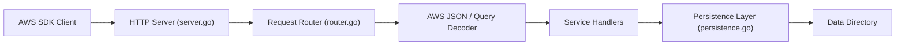

# sivchari/kumo

> Émulateur AWS léger en binaire unique, sans authentification, pour tester en CI.

## Le problème
Tester du code qui appelle AWS (S3, SQS, DynamoDB) en CI coûte de l'argent et exige des identifiants, ou une pile d'émulation lourde.

## Ce que ça fait vraiment
Un serveur local sur le port 4566 qui répond aux appels du SDK AWS Go v2, avec 82 services annoncés (S3, DynamoDB, SQS, SNS, Lambda, IAM, SageMaker, Glue, Athena, etc.). État en mémoire par défaut, persistance JSON optionnelle via `KUMO_DATA_DIR`. Deux points d'accès propres à kumo pour lire les e-mails SES et les SMS envoyés. Le nombre de services est celui du README ; l'étendue réelle par service n'est pas vérifiée.

## Comment c'est branché


## Essayer
```bash
docker run -p 4566:4566 ghcr.io/sivchari/kumo:latest
make build
./bin/kumo
KUMO_DATA_DIR=./data ./bin/kumo
```

## Coût et pièges
Gratuit. Sans `KUMO_DATA_DIR`, tout est perdu à l'arrêt ; les messages SQS en vol et les envois multipart S3 ne sont pas persistés. 168 issues ouvertes pour un dépôt de février 2026.

## Ce que ce n'est pas
Pas AWS : le comportement peut différer de la réalité, et rien ne garantit la fidélité des services moins courants. Pas un outil de charge ni de sécurité.

## Alternatives
Aucune alternative nommée dans le README.

## Pour toi
À surveiller : simuler S3, SQS ou SageMaker en tests d'un pipeline MLOps sans compte AWS est attrayant, mais le projet est jeune et sa fidélité reste à vérifier.

