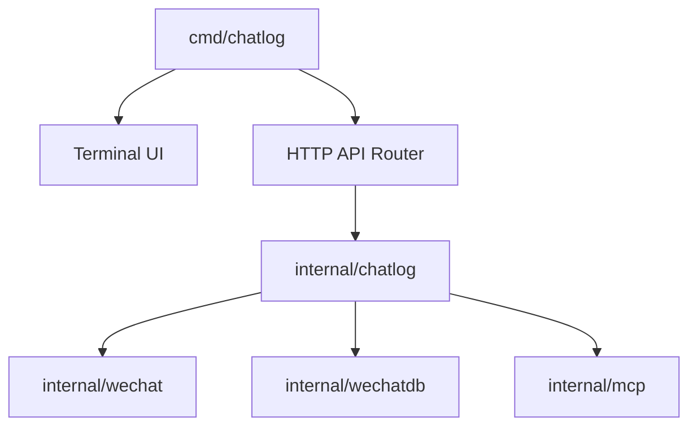

# sjzar/chatlog

> Outil Go qui exposait des historiques de conversations WeChat locaux à des assistants IA ; retiré par son auteur.

## Le problème
Les conversations d'une messagerie restent enfermées dans des bases locales chiffrées. Les exploiter (recherche, assistants IA) suppose d'y accéder.

## Ce que ça fait vraiment
Le README actuel est un avis de retrait daté du 20 octobre 2025 (en chinois). L'auteur a reçu une lettre de WeChat jugeant la fonction centrale risquée pour la conformité, et a supprimé code et historique. Il demande de supprimer les copies locales et déconseille tout usage. D'après l'architecture décrite : CLI avec interface terminale, API HTTP et endpoint MCP SSE au-dessus de modules d'accès aux données WeChat.

## Comment c'est branché

## Essayer
Aucune commande documentée : le dépôt ne contient plus que l'avis de retrait.

## Coût et pièges
Rien à installer ni à payer, puisque le code n'est plus téléchargeable. Reste un risque juridique pour qui garde d'anciennes copies. Licence absente.

## Ce que ce n'est pas
Ce n'est plus un projet disponible, maintenu ou supporté. Le contenu lu est un avis, pas la documentation d'un outil ; les détails techniques ci-dessus viennent de l'architecture décrite, non du README.

## Alternatives
Aucune nommée dans le README.

## Pour toi
À ignorer : code retiré à la demande de l'éditeur de WeChat, aucune licence, aucun support, et l'accès à des données de messagerie tierces pose un problème de conformité.
