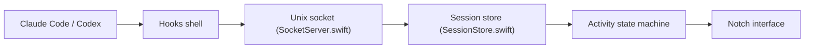

# sk-ruban/notchi

> App macOS qui anime l'encoche du MacBook selon l'activité de Claude Code et Codex.

## Le problème
Suivre ce que font les agents de code en arrière-plan oblige à garder le terminal visible.

## Ce que ça fait vraiment
Installe des hooks shell dans Claude Code et Codex qui envoient des événements via un socket Unix. L'app les analyse, les passe dans une machine d'états et anime des mascottes. Option : analyse de sentiment des prompts via API Anthropic ou OpenAI, suivi du coût et des tokens sur 30 jours.

## Comment c'est branché


## Essayer
```bash
# Pas de commande : télécharger le DMG depuis les releases, le glisser dans Applications, le lancer
```

## Coût et pièges
Gratuit. macOS 15+, MacBook avec encoche. Le sentiment envoie tes prompts à Anthropic ou OpenAI avec ta clé (facturé chez eux). Une fenêtre trousseau demande l'accès pour les stats.

## Ce que ce n'est pas
Pas un outil de monitoring sérieux : c'est un compagnon ludique. Ne fonctionne pas hors macOS.

## Alternatives
Aucune alternative nommée ; le README cite Claude Island en inspiration.

## Pour toi
À ignorer : gadget macOS sans valeur pour un pipeline data/IA ; GPL-3.0 et mainteneur unique en plus.

