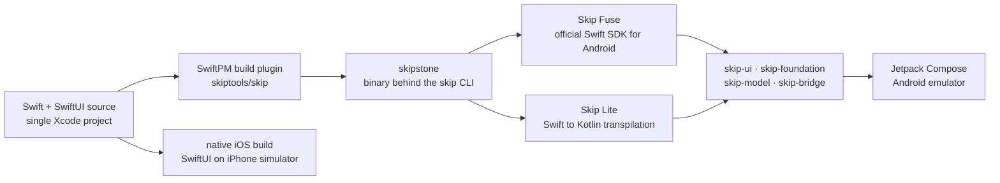

# skiptools/skip

> **For Swift developers: build the Android app from the same SwiftUI code as the iOS app.**

## The problem

Shipping on both iOS and Android without Skip means either maintaining two codebases in two
languages, or adopting a third-party framework — JavaScript, Dart or Kotlin — and giving up
the Swift, SwiftUI and Xcode tooling an iOS team already knows.

## What it actually does

The `skip` repository hosts the Skip SwiftPM build plugin, which integrates with Xcode and
Swift Package Manager to drive the Android build alongside the normal iOS build. It works
together with `skipstone`, the binary that powers both the `skip` CLI and the plugin.

Two development modes are offered. **Skip Fuse** compiles Swift natively for Android using the
official Swift SDK for Android, with bridging to call Kotlin and Java APIs. **Skip Lite**
transpiles Swift source to Kotlin, maximising interoperability with existing Kotlin and Java
libraries.

In both modes SwiftUI is mapped onto Jetpack Compose through the `skip-ui` compatibility
framework. The README states there is no web view, no custom rendering engine and no
additional runtime. Around it, a set of libraries reimplements Apple frameworks for Android:
`skip-foundation`, `skip-model`, `skip-bridge`, `skip-unit`, plus integrations
(`skip-firebase`, `skip-sql`, `skip-keychain`, `skip-web`, `skip-av`, `skip-ffi`…).

## How it is wired

No code-derived diagram exists for this repository: the graph below is reconstructed from the
README alone, from the repository names and commands it cites.



## Trying it

```bash
brew tap skiptools/skip
brew install skip
skip checkup
skip create
```

The project is created and opened in Xcode; run it on an iPhone simulator and Skip also builds
and launches the Android version on a running emulator. For native compilation (Fuse mode) the
README adds:

```bash
skip android sdk install
skip init --native-app --appid=com.example.myapp my-app MyApp
```

## Cost and gotchas

- **Free, no API key and no account**, funded by sponsorship (`skip.dev/sponsor`). The tool
  itself requires no third-party service.
- **Homebrew and Xcode**: installation goes through `brew` and the project opens in Xcode. The
  README documents no path outside macOS.
- **An Android emulator must already be running** for the simultaneous launch to work, on top
  of the iOS simulator: two mobile environments on the same machine.
- **The Swift SDK for Android installs separately** (`skip android sdk install`) for Fuse mode;
  it is not part of `brew install`.
- **MPL-2.0 licence**: file-level copyleft. Modifying Skip's own sources requires publishing
  those changes; using it as a build tool does not affect the application's own code.
- **Two modes to pick up front** (Fuse or Lite), with separate sample repositories: the choice
  shapes the project and the access to Kotlin libraries.

## What it is not

- **Not a library you import**: it is a build chain (SwiftPM plugin plus CLI) that produces an
  Android app. Nothing to add as a dependency inside a service.
- **Not "all of SwiftUI works on Android"**: the mapping goes through the `skip-ui`
  compatibility layer, and Apple frameworks are reimplemented repository by repository.
  Anything without a `skip-*` library has no documented equivalent here.
- **Not a back-end or data tool**: the scope is the client mobile application, iOS and Android.

## Alternatives

| | When to prefer it |
|---|---|
| **Flutter / React Native / Compose Multiplatform / MAUI** | Named by the README as the comparison that matters (the project's own case is published at `skip.dev/compare`). Prefer them when the team is not already a Swift team: Skip only pays off if SwiftUI skills exist. |
| **skiptools/skip-ui** | Cited in the README: the SwiftUI-to-Jetpack-Compose layer on its own. Worth a look when the real question is component coverage rather than the build chain. |

The catalogue neighbours (`ReactiveX/RxSwift`, `onevcat/Kingfisher`,
`SwifterSwift/SwifterSwift`, `GopeedLab/gopeed`) are not comparable: Swift libraries or a
download manager, not cross-platform build chains.

## For you

Off-topic for a data / AI / MLOps profile, with one exception: shipping a demo or data-capture
mobile app when the team is already on Swift. Worth watching, not scheduling — the entry cost
is a macOS machine with Xcode and two mobile environments, for a gain that never touches the
data pipeline.
