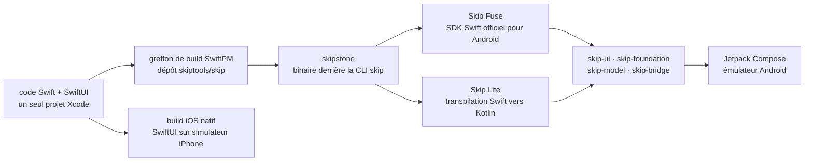

# skiptools/skip

> **Pour développeurs Swift : construire l'application Android à partir du code SwiftUI de l'app iOS.**

## Le problème

Sortir une application sur iOS et Android sans Skip impose soit de tenir deux bases de code
dans deux langages, soit d'adopter un cadre tiers — JavaScript, Dart ou Kotlin — et donc
d'abandonner Swift, SwiftUI et l'outillage Xcode que l'équipe iOS maîtrise déjà.

## Ce que ça fait vraiment

Le dépôt `skip` héberge le greffon de build SwiftPM qui s'intègre à Xcode et à Swift Package
Manager pour piloter la compilation Android en même temps que la compilation iOS habituelle.
Il fonctionne avec `skipstone`, le binaire qui alimente à la fois la CLI `skip` et le greffon.

Deux modes de développement sont proposés. **Skip Fuse** compile le Swift nativement pour
Android via le SDK Swift officiel pour Android, avec un pont pour appeler les API Kotlin et
Java. **Skip Lite** transpile le source Swift en Kotlin, ce qui maximise l'interopérabilité
avec les bibliothèques Kotlin/Java existantes.

Dans les deux modes, SwiftUI est projeté sur Jetpack Compose par la couche de compatibilité
`skip-ui`. Le README annonce qu'il n'y a ni webview, ni moteur de rendu maison, ni runtime
supplémentaire. Autour, une suite de bibliothèques réimplémente les frameworks Apple pour
Android : `skip-foundation`, `skip-model`, `skip-bridge`, `skip-unit`, plus des intégrations
(`skip-firebase`, `skip-sql`, `skip-keychain`, `skip-web`, `skip-av`, `skip-ffi`…).

## Comment c'est branché

Aucun diagramme tiré du code n'existe pour ce dépôt : ce schéma est reconstruit depuis le
seul README, à partir des noms de dépôts et de commandes qu'il cite.



## Essayer

```bash
brew tap skiptools/skip
brew install skip
skip checkup
skip create
```

Le projet est créé puis ouvert dans Xcode ; lancé sur un simulateur iPhone, Skip construit et
démarre en parallèle la version Android sur un émulateur actif. Pour la compilation native
(mode Fuse), le README ajoute :

```bash
skip android sdk install
skip init --native-app --appid=com.example.myapp my-app MyApp
```

## Coût et pièges

- **Gratuit, sans clé d'API ni compte**, financé par le parrainage (`skip.dev/sponsor`). Aucun
  service tiers n'est requis par l'outil lui-même.
- **Homebrew et Xcode** : l'installation passe par `brew`, et le projet s'ouvre dans Xcode. Le
  README ne documente aucun chemin hors macOS — pas de poste Linux ou Windows évoqué.
- **Un émulateur Android doit déjà tourner** pour que le lancement simultané fonctionne, en
  plus du simulateur iOS : deux environnements mobiles sur la même machine.
- **Le SDK Swift pour Android s'installe à part** (`skip android sdk install`) pour le mode
  Fuse ; ce n'est pas inclus dans le `brew install`.
- **Licence MPL-2.0** : copyleft de fichier. Modifier les sources de Skip oblige à publier ces
  modifications ; l'usage comme outil de build ne contamine pas le code de l'application.
- **Deux modes à choisir dès le départ** (Fuse ou Lite), avec des dépôts d'exemples distincts :
  le choix structure le projet et l'accès aux bibliothèques Kotlin.

## Ce que ce n'est pas

- **Ce n'est pas une bibliothèque à importer** : c'est une chaîne de build (greffon SwiftPM +
  CLI) qui produit une application Android. Rien à ajouter comme dépendance dans un service.
- **Ce n'est pas « tout SwiftUI marche sur Android »** : la correspondance passe par la couche
  de compatibilité `skip-ui`, et les frameworks Apple sont réimplémentés dépôt par dépôt. Ce
  qui n'a pas de bibliothèque `skip-*` n'a pas d'équivalent documenté ici.
- **Ce n'est pas un outil de back-end ni de data** : le périmètre est l'application mobile
  cliente, iOS et Android.

## Alternatives

| | Quand le préférer |
|---|---|
| **Flutter / React Native / Compose Multiplatform / MAUI** | Nommés par le README comme la comparaison qui compte (l'argumentaire du projet est publié sur `skip.dev/compare`). À préférer quand l'équipe n'est pas déjà une équipe Swift : Skip n'a d'intérêt que si le savoir-faire SwiftUI existe déjà. |
| **skiptools/skip-ui** | Cité dans le README : la couche SwiftUI → Jetpack Compose seule. À regarder si la question est la couverture réelle des composants, indépendamment de la chaîne de build. |

Les voisins du catalogue (`ReactiveX/RxSwift`, `onevcat/Kingfisher`,
`SwifterSwift/SwifterSwift`, `GopeedLab/gopeed`) ne sont pas comparables : ce sont des
bibliothèques Swift ou un gestionnaire de téléchargement, pas des chaînes multiplateformes.

## Pour toi

Hors sujet pour un profil data / IA / MLOps, sauf cas précis : livrer une application mobile
de démonstration ou de collecte quand l'équipe est déjà côté Swift. À mettre en veille, pas au
programme — le coût d'entrée est un poste macOS avec Xcode et deux environnements mobiles,
pour un gain qui ne touche pas la chaîne de données.
