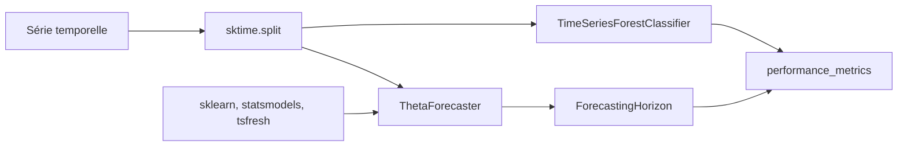

# sktime/sktime

> Interface unifiée façon scikit-learn pour toutes les tâches d'apprentissage sur séries temporelles.

## Le problème
Prévision, classification, clustering et détection de ruptures sur séries temporelles vivent dans des
bibliothèques séparées, aux API incompatibles, qu'on ne peut ni composer ni comparer proprement.

## Ce que ça fait vraiment
Une seule API couvre prévision, classification, régression, transformations (stables), détection,
estimation de paramètres, clustering, distances/noyaux, découpage temporel (en maturation), alignement
et distributions (expérimental). Fournit les briques de composition — pipelines, ensembles, réglage,
réduction — permettant d'appliquer un régresseur scikit-learn à une tâche de prévision. Interfaces vers
scikit-learn, statsmodels, tsfresh, PyOD, fbprophet. Version 1.1.0, Python 3.10 à 3.14, 64 bits.

## Comment c'est branché


## Essayer
```bash
pip install sktime
pip install sktime[all_extras]
pip install sktime[forecasting,transformations]
conda install -c conda-forge sktime
```

## Coût et pièges
Gratuit, licence affichée dans le dépôt. Les dépendances lourdes ne sont pas installées par défaut :
il faut choisir un jeu d'extras, et le README prévient que même un extra n'installe qu'une sélection
choisie. Via conda, ce choix fin n'existe pas : c'est tout ou rien.

## Ce que ce n'est pas
Pas une bibliothèque de deep learning temporel : les modules avancés (alignement, distributions) sont
explicitement expérimentaux, d'autres seulement « en maturation ». Pas un outil de production clés en
main : c'est une couche d'estimateurs, pas un service.

## Alternatives
- **statsmodels** : modèles statistiques bruts, sans interface unifiée ni composition.
- **tsfresh** : extraction de caractéristiques seule.
- **PyOD** : détection d'anomalies, hors cadre séries temporelles unifié.

## Pour toi
La référence pour comparer honnêtement plusieurs approches de prévision sans réécrire le harnais.
