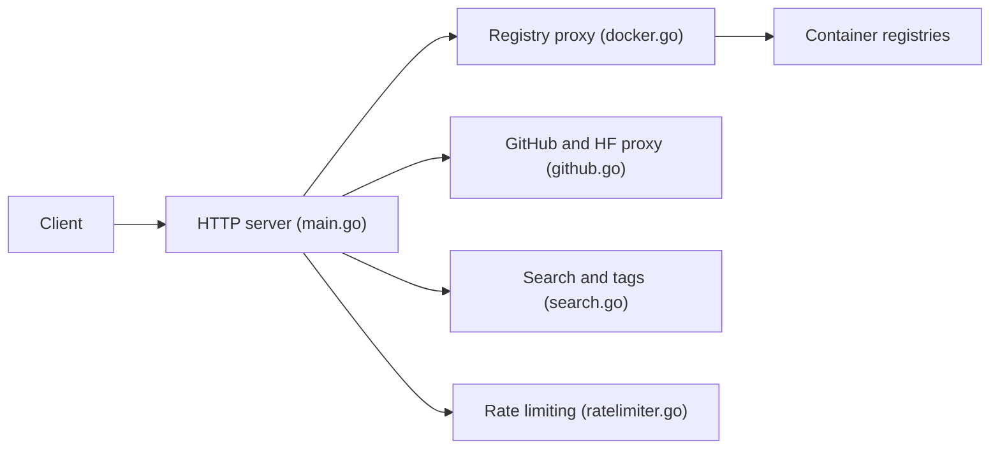

# sky22333/hubproxy

> Proxy auto-hébergé en Go qui accélère Docker, GitHub et Hugging Face, pour réseaux lents ou filtrés.

## Le problème
Tirer des images, cloner des dépôts ou télécharger des modèles depuis des réseaux lents ou restreints est pénible.

## Ce que ça fait vraiment
Un binaire Go sert de proxy compatible Registry API v2 (Docker Hub, GHCR, Quay, GCR, registry.k8s.io), de relais pour les releases, raw et git clone GitHub (avec réécriture des URL dans les scripts `.sh`/`.ps1`) et pour les fichiers Hugging Face. Il ajoute limitation de débit par IP, listes noires/blanches, proxy SOCKS5 sortant et une interface Vue pour chercher des images et télécharger des archives hors ligne.

## Comment c'est branché


## Essayer
```bash
docker run -d --name hubproxy -p 5000:5000 --restart always ghcr.io/sky22333/hubproxy
curl http://127.0.0.1:5000/ready
docker pull yourdomain.com/nginx
```

## Coût et pièges
Gratuit ; bande passante à ta charge. Le README déconseille d'exposer `http://IP:5000` nu : prévoir un domaine, HTTPS et reverse proxy.

## Ce que ce n'est pas
Pas un registre : il relaie, il ne stocke pas tes images. Un proxy ouvert peut être abusé : configure limites et listes d'accès.

## Alternatives
Aucune alternative nommée dans le README.

## Pour toi
À surveiller : utile si tu télécharges souvent images et modèles depuis un réseau contraint, à condition de le sécuriser derrière HTTPS.

