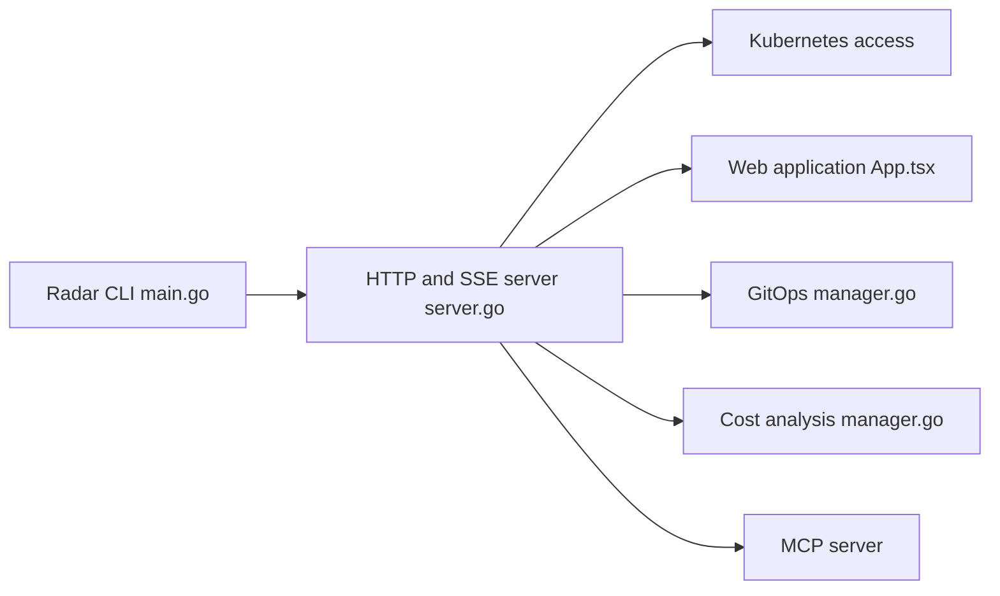

# skyhook-io/radar

> Interface Kubernetes open source en binaire unique, locale ou dans le cluster, avec serveur MCP pour agents.

## Le problème
Inspecter un cluster (topologie, Helm, GitOps, coûts, RBAC) demande plusieurs outils et beaucoup de `kubectl`.

## Ce que ça fait vraiment
Binaire qui lit l'API Kubernetes avec tes identifiants et sert une UI web en temps réel (SSE). Vues : topologie, ressources, Helm, comparaison, TLS, GitOps (Argo CD, Flux), trafic (Hubble, Istio, Beyla…), coûts OpenCost, audit de 31 contrôles, impact de mise à niveau, RBAC. Serveur MCP activé par défaut, désactivable avec `--no-mcp`.

## Comment c'est branché


## Essayer
```bash
curl -fsSL https://get.radarhq.io | sh && kubectl radar
brew install skyhook-io/tap/radar
kubectl krew install radar
helm install radar skyhook/radar -n radar --create-namespace
```

## Coût et pièges
Gratuit en local. Pas d'authentification par défaut : en cluster, activer proxy ou OIDC. Rapport d'usage anonyme désactivé sauf opt-in. Les actions d'écriture MCP passent par le RBAC Kubernetes.

## Ce que ce n'est pas
Pas un outil de supervision persistante : timeline en mémoire par défaut. L'offre hébergée multi-cluster (Radar Cloud) est payante et séparée.

## Alternatives
Aucune alternative nommée dans le README (Polaris, Kubescape, Trivy cités comme inspirations de l'audit).

## Pour toi
À surveiller si tu opères des clusters (MLOps) : bon rapport découverte/effort, mais hors périmètre si tu n'utilises pas Kubernetes.

