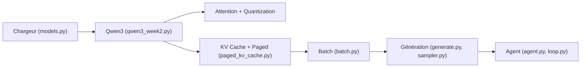

# skyzh/tiny-llm

> Cours pratique pour comprendre l'inférence LLM de bout en bout en construisant Qwen3 sur MLX.

## Le problème
On utilise des moteurs d'inférence sans comprendre le chemin des tokens aux logits : cache KV, batching, noyaux.

## Ce que ça fait vraiment
Un cours de quatre semaines sur tableaux MLX, sans couches haut niveau. S1 : Qwen3 depuis `mlx.core` (attention, RoPE, GQA, RMSNorm, échantillonnage). S2 : cache KV, benchmarks, noyaux quantifiés et fusionnés (Python, C++, Metal). S3 : mini vLLM avec batching continu et cache KV paginé. S4 : agent de code borné avec checkpoints, reçus et compaction, publié par jalons. `tiny_llm` reçoit tes solutions, `tiny_llm_ref` contient la référence.

## Comment c'est branché


## Essayer
```bash
pdm install -v
pdm run check-installation
pdm run test-refsol -- -- -k week_1
```

## Coût et pièges
Gratuit ; pensé pour Apple silicon (MLX, Metal), Qwen3-4B quantifié en 4 bits. La semaine 4 est publiée incrémentalement, donc inachevée.

## Ce que ce n'est pas
Pas un moteur de serving prêt à l'emploi ; pas pour GPU CUDA. Il faut faire les exercices pour en tirer quelque chose.

## Alternatives
Needle de CMU (cité comme équivalent côté entraînement) ; vLLM est cité comme référence à approcher.

## Pour toi
À adopter si tu veux maîtriser le fonctionnement interne de l'inférence LLM sur un Mac ; sur Linux/NVIDIA, le cours perd son support.

