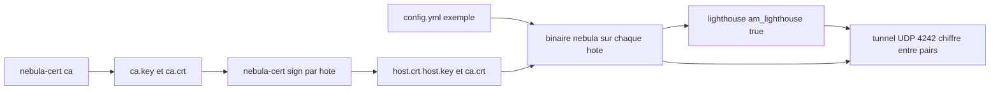

# slackhq/nebula

> **Encrypted overlay network between scattered machines, driven by certificates and groups, for sysadmins.**

## The problem

Getting machines spread across several hosting providers, datacenters and roaming laptops to
talk to each other usually means a shared addressing plan, site-to-site VPNs and firewall
rules written per provider. The README frames the need differently: groups of hosts that can
communicate securely across the internet, with traffic rules expressed the way cloud security
groups are, without having to maintain a particular addressing scheme.

## What it actually does

Nebula is a mutually authenticated peer-to-peer software-defined network built on the Noise
Protocol Framework. Each node carries a certificate asserting its IP address, its name and its
membership in user-defined groups; those groups then drive provider-agnostic traffic filtering
between nodes. Discovery nodes, called lighthouses, let peers find each other and optionally
use UDP hole punching to establish connections from behind most firewalls or NATs. The default
configuration uses ECDH key exchange and AES-256-GCM. It runs on Linux, Windows, macOS,
FreeBSD, iOS and Android, from a handful of computers to tens of thousands per the README.

## How it is wired



The README lays out seven steps along that line: create a certificate authority with
`nebula-cert ca`, producing `ca.key` and `ca.cert`; sign one certificate per host with
`nebula-cert sign`, setting the IP inside the chosen subnet and optionally some groups; start
from the repo's `examples/config.yml`, setting `am_lighthouse: true` on the discovery node and
declaring that node in `static_host_map` and in the lighthouse `hosts` section elsewhere; copy
the binary, the config, `ca.crt`, `{host}.crt` and `{host}.key` to each machine — never
`ca.key` — then run the binary. Default tunnel traffic is UDP port 4242.

## Trying it

```sh
brew install nebula
# or: sudo apt install nebula / sudo dnf install nebula / sudo pacman -S nebula
# or: sudo apk add nebula / docker pull nebulaoss/nebula

./nebula-cert ca -name "Myorganization, Inc"

./nebula-cert sign -name "lighthouse1" -ip "192.168.100.1/24"
./nebula-cert sign -name "laptop" -ip "192.168.100.2/24" -groups "laptop,home,ssh"
./nebula-cert sign -name "server1" -ip "192.168.100.9/24" -groups "servers"
./nebula-cert sign -name "host3" -ip "192.168.100.10/24"

./nebula -config /path/to/config.yml
```

Building from source with Go installed: `make all`, or `make bin-windows` for one platform.
The README documents no command to functionally test the tunnel once it is up.

## Cost and traps

The software is free and distribution packages exist for Arch, Fedora, Debian, Alpine,
Homebrew and Docker. The real cost is elsewhere: you need at least one lighthouse with a
routable IP, so an instance at a hosting provider — the README mentions $6/mo DigitalOcean
droplets — with UDP 4242 reachable over the internet. Calendar trap: certificate authorities
have a 1-year lifetime by default, and host certificates expire one second before the CA, so
rotation must be planned (a separate guide covers it) or lifetimes shortened with `-duration`.
`ca.key` is the most sensitive file and must never be copied to nodes. FIPS 140-3 mode
(`make fips140`) requires building yourself; the BoringCrypto variant is stated as deprecated
and slated for removal in the next release. Finally, the README points anyone who does not
want to run their own PKI and lighthouses to the commercial Managed Nebula offering from
Defined Networking.

## What it is not

It is not a turnkey VPN you install and forget: without a managed PKI, the administrator owns
the CA, certificate signing, file distribution and the yearly rotation. It is not a hosted
service either — the project is the software, the managed version is a separate commercial
product. And it is not a data or compute tool: it moves packets between hosts, it provides no
storage, no application service discovery and no HTTP proxy. The README leans on promotional
adjectives ("seamlessly", "scalable") that should be read as presentation vocabulary.

## Alternatives

The README names no competing project, only the commercial Managed Nebula offering built on
the same software. Among the neighbours supplied, rclone/rclone, soimort/you-get,
projectdiscovery/nuclei and StevenBlack/hosts cover neither overlay networking nor encrypted
tunnels: no comparable alternative in the catalogue.

## For you

Worth a look if your training jobs, storage and workstations live at several providers and you
want a single addressing plan with group-based filtering, without exposing public ports. Skip
it if your scope fits in one VPC, where the provider's own networking already does the job
with no PKI to maintain.
