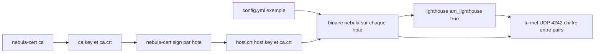

# slackhq/nebula

> **Réseau overlay chiffré entre machines dispersées, piloté par certificats et groupes, pour sysadmins.**

## Le problème

Faire dialoguer des machines réparties chez plusieurs hébergeurs, dans des datacenters et sur
des postes nomades suppose d'habitude un plan d'adressage commun, des VPN site à site et des
règles de pare-feu propres à chaque fournisseur. Le README pose le besoin autrement : des
groupes d'hôtes qui communiquent de façon sûre à travers Internet, avec des règles de filtrage
exprimées comme des security groups de cloud, sans dépendre du schéma d'adressage de chacun.

## Ce que ça fait vraiment

Nebula est un réseau défini par logiciel, pair à pair, mutuellement authentifié, construit sur
le Noise Protocol Framework. Chaque nœud porte un certificat qui affirme son adresse IP, son
nom et son appartenance à des groupes définis par l'utilisateur ; ces groupes servent ensuite
au filtrage du trafic, indépendamment du fournisseur d'hébergement. Des nœuds de découverte,
appelés lighthouses, permettent aux pairs de se trouver et, si besoin, de faire du UDP hole
punching pour traverser la plupart des pare-feux et NAT. La configuration par défaut repose
sur un échange de clés ECDH et sur AES-256-GCM. L'outil tourne sur Linux, Windows, macOS,
FreeBSD, iOS et Android, du petit groupe de machines à plusieurs dizaines de milliers selon
le README.

## Comment c'est branché



Le README décrit sept étapes qui suivent ce fil : on crée une autorité de certification avec
`nebula-cert ca`, ce qui produit `ca.key` et `ca.cert` ; on signe un certificat par hôte avec
`nebula-cert sign`, en fixant l'IP dans le sous-réseau choisi et, éventuellement, des groupes ;
on part de l'`examples/config.yml` du dépôt, en positionnant `am_lighthouse: true` sur le nœud
de découverte et en déclarant ce dernier dans `static_host_map` et dans la section `hosts` des
autres ; on copie sur chaque machine le binaire, la configuration, `ca.crt`, `{host}.crt` et
`{host}.key` — jamais `ca.key` — puis on lance le binaire. Le trafic UDP par défaut est sur le
port 4242.

## Essayer

```sh
brew install nebula
# ou : sudo apt install nebula / sudo dnf install nebula / sudo pacman -S nebula
# ou : sudo apk add nebula / docker pull nebulaoss/nebula

./nebula-cert ca -name "Myorganization, Inc"

./nebula-cert sign -name "lighthouse1" -ip "192.168.100.1/24"
./nebula-cert sign -name "laptop" -ip "192.168.100.2/24" -groups "laptop,home,ssh"
./nebula-cert sign -name "server1" -ip "192.168.100.9/24" -groups "servers"
./nebula-cert sign -name "host3" -ip "192.168.100.10/24"

./nebula -config /path/to/config.yml
```

Compilation depuis les sources avec Go installé : `make all`, ou `make bin-windows` pour une
plateforme précise. Le README ne documente pas de commande de test fonctionnel du tunnel.

## Coût et pièges

Le logiciel est gratuit et les paquets de distribution existent pour Arch, Fedora, Debian,
Alpine, Homebrew et Docker. Le coût réel est ailleurs : il faut au moins un lighthouse avec
une IP routable, donc une instance chez un hébergeur — le README mentionne des droplets
DigitalOcean à 6 $/mois — et ouvrir l'UDP 4242 vers elle. Piège de calendrier : par défaut une
autorité de certification expire au bout d'un an, et les certificats d'hôte expirent une
seconde avant la CA ; il faut donc prévoir la rotation, documentée à part, ou raccourcir la
durée avec `-duration`. `ca.key` est le fichier le plus sensible et ne doit jamais être copié
sur les nœuds. Le mode FIPS 140-3 (`make fips140`) impose une compilation maison ; la variante
BoringCrypto est annoncée dépréciée et retirée à la prochaine version. Enfin, le README
n'assume pas la gestion de PKI et de lighthouses pour tout le monde : il renvoie vers l'offre
commerciale Managed Nebula de Defined Networking pour qui ne veut pas s'en occuper.

## Ce que ce n'est pas

Ce n'est pas un VPN clé en main à installer et oublier : sans PKI gérée, l'administrateur
porte la CA, la signature des certificats, la distribution des fichiers et la rotation
annuelle. Ce n'est pas non plus un service hébergé — le projet est le logiciel, la version
managée est un produit commercial distinct. Enfin, ce n'est pas un outil de données ni de
calcul : il déplace des paquets entre hôtes, il ne fournit ni stockage, ni découverte de
services applicatifs, ni proxy HTTP. Le README emploie plusieurs adjectifs promotionnels
(« seamlessly », « scalable ») qu'il faut lire comme du vocabulaire de présentation.

## Alternatives

Le README ne nomme aucun projet concurrent, seulement l'offre commerciale Managed Nebula qui
s'appuie sur le même logiciel. Parmi les voisins fournis, rclone/rclone, soimort/you-get,
projectdiscovery/nuclei et StevenBlack/hosts ne couvrent ni le réseau overlay ni le tunnel
chiffré : aucune alternative comparable dans le catalogue.

## Pour toi

Intéressant si tes jobs d'entraînement, tes stockages et tes postes de travail vivent chez
plusieurs fournisseurs et que tu veux un plan d'adressage unique avec filtrage par groupes,
sans ouvrir de ports publics. À écarter si ton périmètre tient dans un seul VPC, où le
réseau du fournisseur fait déjà le travail sans PKI à entretenir.
