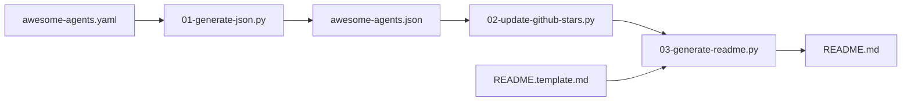

# slavakurilyak/awesome-ai-agents

> Liste d'environ 200 projets d'agents IA, classés par étoiles, tenue par un consultant.

## Le problème
Les projets d'agents IA sont nombreux et il est difficile de s'y repérer.

## Ce que ça fait vraiment
Le README affiche un Top 10 et un « Rising 10 » avec étoiles au 2025-07-30, puis une liste alphabétique d'environ 200 noms. Les sections de la liste complète sont présentes, mais les descriptions sont vides dans le texte fourni. Un pipeline de trois scripts Python génère JSON, met à jour les étoiles via l'API GitHub et rend le README.

## Comment c'est branché


## Essayer
Aucune commande d'utilisation : c'est une liste à lire.
```bash
# rien à exécuter, liste à consulter
```

## Coût et pièges
Gratuit. Les chiffres d'étoiles datent de 2025-07-30 et le dernier push de 2025-09-09 ; le fichier contient des doublons (Open Interpreter deux fois). Le dépôt sert aussi à promouvoir les services de son auteur.

## Ce que ce n'est pas
Pas une évaluation : pas de comparaison ni de critère de choix. 300 issues ouvertes.

## Alternatives
- Aucune alternative nommée dans le README.

## Pour toi
Ignorer : liste figée, sans descriptions exploitables, à remplacer par ta veille GitHub actuelle.
