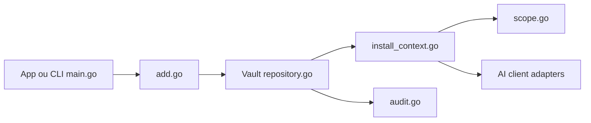

# sx — sleuth-io/sx

> Gestionnaire de skills, agents, règles et MCP versionnés, partagés via un dossier synchronisé ou git.

## Le problème
Les assets IA vivent dans un dépôt et dérivent dès qu'on les copie vers un autre.

## Ce que ça fait vraiment
Un coffre (vault) en dossier Dropbox/Drive, dépôt git ou service Skills.new ; manifeste `sx.toml` et verrou par utilisateur, comme npm. `sx add` ajoute, `sx install` distribue par portée (org, repo, chemin, équipe, bot, utilisateur) dans plusieurs clients IA. Audit, statistiques d'usage, relais cloud pour claude.ai et chatgpt.com, bibliothèque Go. App de bureau et CLI partagent la configuration.

## Comment c'est branché


## Essayer
```bash
brew install sleuth-io/tap/sx
sx init --type path --path ~/Dropbox/sx-vault
sx add ~/.claude/skills/my-skill
sx install my-skill --org
sx stats
```

## Coût et pièges
Gratuit en local ou git ; Skills.new (gestion centralisée) est le palier pour grandes équipes, tarif non précisé. Le relais cloud passe par skills.new.

## Ce que ce n'est pas
Pas un marché de skills : un outil de distribution. Le contenu des skills reste ton affaire ; le flux de revue (RBAC) est encore sur la feuille de route.

## Alternatives
- Plugin marketplace de Claude Code et Codex : sans sx, mais skills seulement.
- hetchy : exécute les agents sans surveillance avec sx.

## Pour toi
À surveiller : utile si ton équipe partage plusieurs skills entre outils ; seul, un dépôt git suffit.

